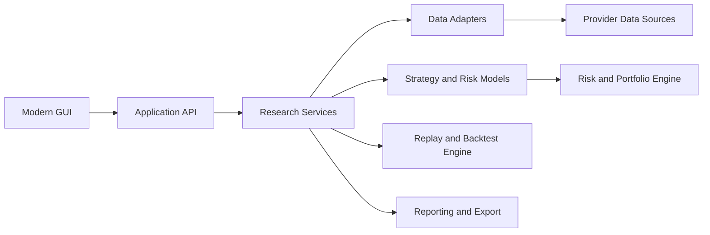

# System Architecture

## Overview

The platform architecture is organized around a modular research stack with a modern UI, service-oriented backend, data adapters, analytics engines, and an extensible plugin system.

## High-Level Architecture

## Major Components

- Frontend: dashboard, strategy builder, backtest runner, results explorer, option chain explorer, portfolio analysis, watchlists, and saved research.
- Backend services: orchestration, execution simulation, strategy management, analytics, reporting, and AI assistance.
- Data layer: provider adapters for ORATS, Databento, Polygon, Cboe, and future integrations.
- Research core: replay engine, optimizer, scenario simulator, and portfolio risk lab.
- Plugin layer: extension points for providers, strategies, brokers, indicators, pricing models, risk models, and reports.

## Deployment Considerations

- Support local development, containerized deployment, and future cloud-based scaling.
- Separate configuration, secrets, and reproducibility metadata from runtime execution logic.
- Provide observability, validation output, and export pipelines for research artifacts.
