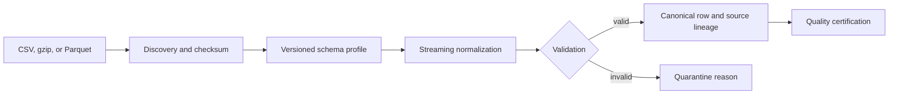

# Data Providers

Sprint 10A separates provider metadata and credentials from local transport, discovery, mapping,
normalization, validation, and certification. Provider capability flags are explicit: an absent
feature is never inferred. Credential configuration stores environment-variable references only;
resolved values are redacted and must not be persisted or logged.

## Local workflow

`LocalDatasetProvider.discover()` returns a plan before ingestion. `ingest()` processes files in
deterministic order, normalizes timezone-aware timestamps to UTC, preserves source file/checksum/
row metadata, rejects ambiguous aliases, and deduplicates canonical quote identities. CSV and
gzip CSV are dependency-free. Parquet uses PyArrow when installed and reads bounded record batches.

The ORATS, Databento, Cboe, and Polygon profiles are integration placeholders. They deliberately
make no claim of vendor schema accuracy until licensed samples have been validated. Authenticated
downloads, pagination, provider rate limiting, scheduled synchronization, and automatic vendor
schema detection remain later Sprint 10 work.
