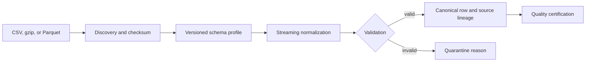
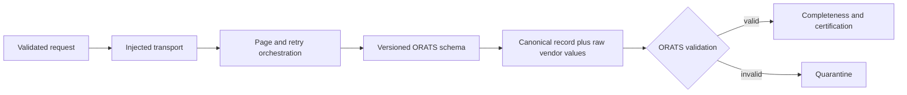
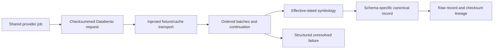

# Data Providers

Sprint 10A separates provider metadata and credentials from local transport, discovery, mapping,
normalization, validation, and certification. Provider capability flags are explicit: an absent
feature is never inferred. Credential configuration stores environment-variable references only;
resolved values are redacted and must not be persisted or logged.

## Local workflow

`LocalDatasetProvider.discover()` returns a plan before ingestion. `ingest()` processes files in
deterministic order, normalizes timezone-aware timestamps to UTC, preserves source file/checksum/
row metadata, rejects ambiguous aliases, and deduplicates canonical quote identities. CSV and
gzip CSV are dependency-free. Parquet uses PyArrow when installed and reads bounded record batches.

The ORATS, Databento, Cboe, and Polygon profiles are integration placeholders. They deliberately
make no claim of vendor schema accuracy until licensed samples have been validated. Authenticated
downloads, pagination, provider rate limiting, scheduled synchronization, and automatic vendor
schema detection remain later Sprint 10 work.

## ORATS adapter

Sprint 10B adds an injectable ORATS adapter under `backend.data.orats`. Production credentials
remain environment-only; the adapter itself accepts a transport and never logs or owns a token.
The deterministic fake transport supports fixture pages, retryable failures, cursors, cancellation,
checksums, and rate-limit observations without sleeping or accessing the network.

Only the synthetic `orats-eod-fixture-v1` schema is asserted. Intraday coverage, dividends,
earnings, corporate actions, settlement/exercise metadata, and adjusted deliverables remain
license-dependent and are explicitly reported as unsupported. A user must validate production
credentials and licensed schemas before enabling live transport.

## Databento and shared provider operations

Sprint 10C adds a synthetic, offline Databento adapter and a provider-neutral operational service.
Requests have deterministic checksums; batches expose continuation and response checksums; changed
checkpoint content is rejected rather than overwriting lineage. Symbology resolution is effective-
dated and rejects unresolved or ambiguous instruments.

The fixture catalogue does not assert availability of any licensed Databento dataset. Option data
support is dataset-, schema-, and license-dependent. Provider IV and Greeks are explicitly
unsupported rather than synthesized. Native SDK/binary parsing remains an optional future adapter.

## Cross-provider reconciliation

Sprint 10D introduces immutable provider observations, deterministic contract identities,
versioned precedence policies, absolute and relative divergence tolerances, and merge previews.
Every selected field records its provider provenance. Identity conflicts require manual review;
multiplier, exercise, settlement, and adjusted-deliverable conflicts are quarantined. Raw provider
observations are never modified.

Cboe and Polygon expose conservative metadata foundations only. Their licensed quote/trade access
is not validated and live fetches fail explicitly. Migration `0020_provider_operations` adds the
durable job, event, checkpoint, checksum, and unresolved-failure spine shared by all providers.

Sprint 10D.1 adds `python -m backend.data.provider_cli` as the executable offline provider
operations boundary. Its handlers call the versioned `ProviderApiService`; argument parsing contains
no ingestion business logic. Outputs use deterministic redacted JSON or self-contained escaped HTML.
Migration `0021_provider_operations_completion` adds immutable typed operational artifacts indexed
by provider, kind, job, and checksum for catalogues, capabilities, retries, synchronization,
certifications, comparisons, reconciliation, monitoring, and export metadata.
