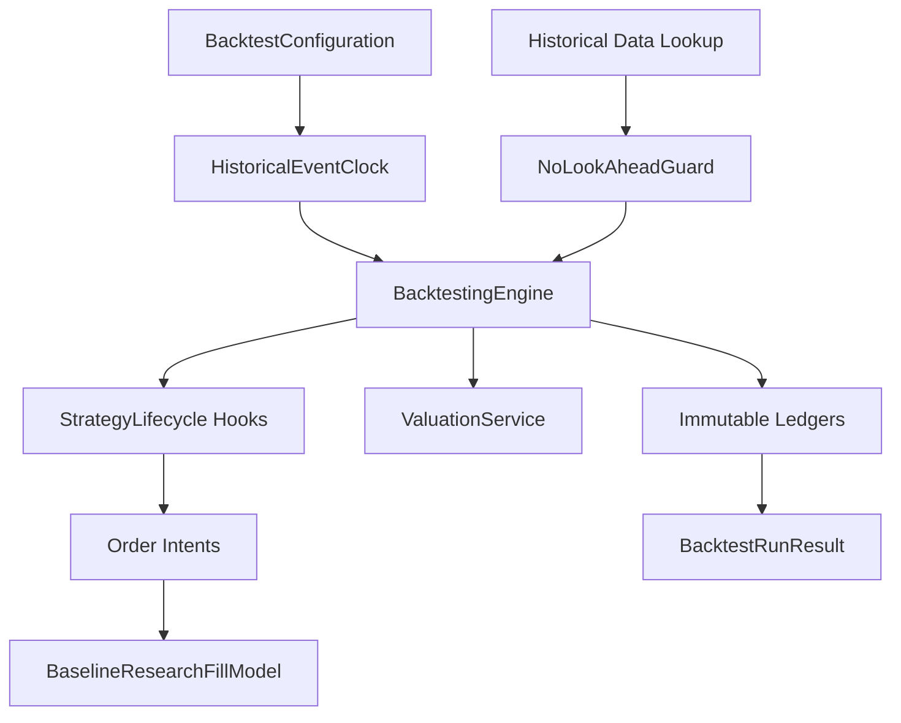

# 05 Backtesting Engine (Sprint 6A)

## Scope

Sprint 6A introduces a deterministic, provider-neutral historical event loop foundation in `backend/backtesting`.

- deterministic event ordering by timestamp, priority, and sequence
- explicit no-look-ahead information-set audits for every lookup
- provider-neutral research order intents and baseline research fill model
- immutable event/trade/cash/valuation ledgers
- expiration and corporate-action event foundations (settlement deferred)
- typed as-of queries with nearest-prior semantics

## Event Loop

## No-Look-Ahead Controls

- Every lookup must pass `NoLookAheadGuard.assert_visible`.
- Lookup metadata is persisted as information-set audit records.
- As-of service defaults to nearest-prior and never returns future rows.

## Known Limitations (Sprint 6A)

- Full assignment, exercise settlement, and margin logic are deferred to Sprint 6B/7.
- Baseline fill model is research-only and not realistic execution.
- Broker connectivity and live execution are intentionally excluded.
