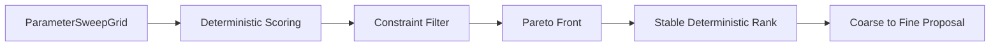
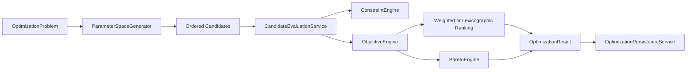

# Optimization Engine

## Purpose

This document defines the optimization boundary for research workflows and parameter search orchestration.

## Sprint 5A Foundation

Sprint 5A introduces a dedicated, provider-neutral optimization subsystem in `backend/optimization` with deterministic behavior and extensible interfaces.

Implemented in Sprint 5A:

- strongly typed optimization problem contracts
- typed parameter-space framework with dependencies and forbidden combinations
- deterministic exhaustive generation and coarse-to-fine refinement
- deterministic low-discrepancy placeholder interface
- hard and soft constraint evaluation with explicit rejection reasons
- reusable objective framework with direction metadata and normalization
- weighted and lexicographic ranking
- deterministic Pareto extraction and dominance diagnostics
- walk-forward split generation hooks (anchored, rolling, expanding)
- serial and deterministic thread-pool execution modes
- optimization run persistence contracts and reproducibility metadata

## Deterministic Refinement Flow

## Architecture

## Parameter-Space Semantics

Supported parameter types:

- integer ranges
- float ranges
- categorical choices
- boolean parameters
- ordered discrete values

Supported composition semantics:

- conditional parameters
- dependent-parameter rules
- forbidden parameter combinations
- custom validation hooks
- candidate limits

## Objective Framework

Objectives support:

- maximize and minimize directions
- weighted scalar scoring
- lexicographic ordering
- constrained scoring via soft penalties
- Pareto multi-objective analysis
- normalization policies (`none`, `min_max`)
- missing-metric policy controls (`fail`, `zero`, `ignore`)

## Constraint Behavior

- Hard constraints reject candidates.
- Soft constraints apply explicit penalties.
- Missing metrics produce structured failure reasons.
- Rejections are retained in run outputs and never silently dropped.

## Walk-Forward Hooks

Supported deterministic split modes:

- anchored
- rolling
- expanding

Each split supports:

- training, validation, and test windows
- purge period
- embargo period
- no-look-ahead chronology validation

## Persistence Model

Optimization persistence stores:

- optimization problem and parameter-space definitions
- objective/constraint definitions
- candidate ordering and per-candidate results
- Pareto front and selected winners
- dataset manifests and volatility-surface snapshots
- lifecycle and pricing-model policies
- random seed and software Git commit
- status, runtime statistics, diagnostics, and checksums

## Explicitly Deferred Beyond Sprint 5A

The following interfaces are intentionally deferred to later sprints:

- Bayesian optimization
- Tree-structured Parzen estimators (TPE)
- Gaussian-process optimization
- Genetic/evolutionary optimization
- Machine-learning-driven ranking or search
- Distributed optimization scheduling
- Hyperparameter walk-forward optimizer tuning

## Validation Expectations

- Objective directions (maximize/minimize) must be explicit.
- Constraints must be deterministic and auditable.
- Ranking tie-breaks must be stable for identical metric inputs.
- Refinement outputs must include source-case lineage and selected objective policy.
