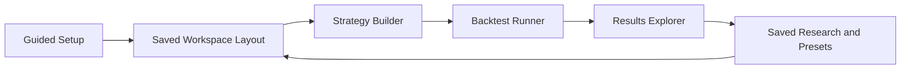

# GUI Design

## Purpose

Define a user-centered interface foundation that keeps quantitative computation in backend services while making the platform usable for non-programmers.

## Design Principles

- Progressive disclosure: basic workflows first, advanced controls expandable.
- Explainability: tooltips, inline help, and guided setup for first-time users.
- Consistency: shared interaction patterns across dashboard, strategy, analytics, and reports.
- Accessibility: keyboard navigation, ARIA-friendly controls, color contrast, and scalable typography.
- Reversibility: undo/reset for strategy configuration and reusable presets.

## UX Foundation Scope

- Light and dark themes.
- Responsive layouts (desktop, tablet, mobile constraints).
- Resizable panel workspace.
- Saved layouts and workspace import/export.
- Keyboard shortcuts.
- Guided setup experience.
- Tooltips and contextual explanations.
- Advanced settings hidden behind progressive controls.
- Accessible control requirements documented for all core features.

## Feature Modules Planned for GUI

- Dashboard
- Strategy Builder
- Backtest Runner
- Results Explorer
- Option Chain Explorer
- Volatility Lab
- 3D Volatility Surface Viewer
- Term Structure Explorer
- Portfolio Risk Lab
- Research Notebook
- Optimization Workspace
- Saved Research
- Settings
- AI Research Assistant

## Interaction Flow

## Non-Goals

- No complete GUI implementation in this phase.
- No direct database-model binding from UI components.
- No live API integrations beyond typed placeholders.
