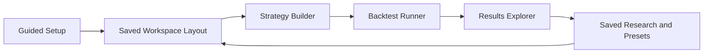

# GUI Design

## Purpose

Define a user-centered interface foundation that keeps quantitative computation in backend services while making the platform usable for non-programmers.

## Design Principles

- Progressive disclosure: basic workflows first, advanced controls expandable.
- Explainability: tooltips, inline help, and guided setup for first-time users.
- Consistency: shared interaction patterns across dashboard, strategy, analytics, and reports.
- Accessibility: keyboard navigation, ARIA-friendly controls, color contrast, and scalable typography.
- Reversibility: undo/reset for strategy configuration and reusable presets.

## UX Foundation Scope

- Light and dark themes.
- Responsive layouts (desktop, tablet, mobile constraints).
- Resizable panel workspace.
- Saved layouts and workspace import/export.
- Keyboard shortcuts.
- Guided setup experience.
- Tooltips and contextual explanations.
- Advanced settings hidden behind progressive controls.
- Accessible control requirements documented for all core features.

## Feature Modules Planned for GUI

- Dashboard
- Strategy Builder
- Backtest Runner
- Results Explorer
- Option Chain Explorer
- Volatility Lab
- 3D Volatility Surface Viewer
- Term Structure Explorer
- Portfolio Risk Lab
- Research Notebook
- Optimization Workspace
- Saved Research
- Settings
- AI Research Assistant

## Interaction Flow

## Non-Goals

- No complete GUI implementation in this phase.
- No direct database-model binding from UI components.
- No live API integrations beyond typed placeholders.

## Sprint 11C research workspace

The research workspace uses one tabbed, narrow-window-safe surface for catalogue, configuration,
results, trades, events, experiments, optimization, validation, and reports. Configuration is a
four-stage progressive workflow with backward navigation and local draft restoration. A run stays
disabled until the user explicitly acknowledges synthetic-data and dataset warnings.

Charts include a text description and tabular alternative; differences and status never rely on
colour alone. Progress uses native accessible status and progress semantics. Command/Ctrl-S saves
the selected workspace tab, while Escape returns to the run catalogue.

```mermaid
flowchart LR
    Strategy[Saved strategy] --> Dataset[Certified dataset]
    Dataset --> Validate[Backend validation boundary]
    Validate --> Confirm[Explicit confirmation]
    Confirm --> Run[Backtest run]
    Run --> Results[Results and trades]
    Results --> Optimize[Optimization]
    Optimize --> WF[Walk-forward]
    WF --> CPCV[CPCV and robustness]
    CPCV --> Report[Reproducible report]
```

## Sprint 8A UI Requirements

GUI strategy catalogue should present canonical identifier, aliases, template family, risk class, validation output, and payoff preview in read-only research context.
# Sprint 11A provider workstation

The desktop uses a restrained research-terminal language: dense tables, aligned numerics, explicit
status colours, visible keyboard focus, reduced-motion support, and system light/dark palettes.
Synthetic data is always marked. Destructive cleanup and network-policy changes require backend
authorization and confirmation boundaries; secrets never enter browser storage.

Keyboard foundations reserve Command/Ctrl-K for the launcher and support semantic link/button/table
navigation today. Refresh, selected-job opening, dialogs, and provider-tab switching extend through
the existing hotkey boundary as those interactions become live.

## Strategy workspace

Sprint 11B uses a responsive split workspace: chain research on the left and the typed strategy
draft on the right. Calls and puts remain text-labelled and do not depend on colour. Contract rows
carry provider, certification, quote quality, exercise, settlement, multiplier, and adjusted status.
Immediate fixture premium and Greek aggregation is labelled synthetic and must be reconciled with
backend preview contracts before research use. Missing quotes never produce a net premium.

Leg roles are explicit and survive ordering changes. Policy presets are fixture defaults, not advice
or guarantees. Backend validation remains authoritative for structure, margin, assignment, pricing,
roll conflicts, and workspace persistence.
