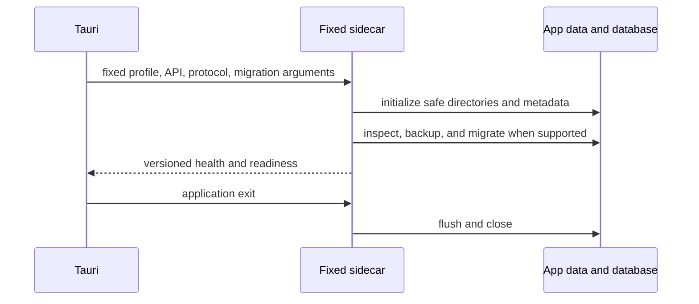

# Deployment

The desktop packages a fixed architecture-named PyInstaller backend sidecar. Tauri launches only
that executable with fixed loopback, application-data, port, and offline-fixture arguments, clears
the inherited environment, tracks the child, and shuts it down with the application. The build
command validates the embedded version, readiness endpoint, and graceful shutdown.

Restricted Tauri commands provide atomic export writes and approved workspace-metadata reads with
absolute paths, extension and size limits, overwrite confirmation, symlink rejection, canonical
parents, and temporary cleanup. CSP allows local assets and loopback backend connections only.

Rust checks, a release build, an unsigned macOS `.app` bundle, packaged startup, bundled-sidecar
health, and shutdown were validated locally. Signing, notarization, and clean-machine cross-platform
validation remain Sprint 12.

Sprint 12A makes `release/version.json` canonical, adds fixed release profiles and dependency locks,
and packages Alembic migrations, release defaults, synthetic fixture metadata, and notices into the
sidecar. `make release-build` creates an unsigned local bundle; `make rc-build` additionally enforces
a clean tree. Release artifacts and evidence are local and Git-ignored.

Sprint 12B validates clean-profile launch from a copied `.app`, source-tree independence, first-run
application-data initialization, upgrade from a synthetic previous schema, recovery scenarios,
reinstall with retained data, shutdown, and orphan prevention. External clean-machine validation,
signing, and notarization remain unclaimed.

Sprint 12C deployment boundary: packaged and local release checks must not include credentials,
licensed provider payloads, or unrestricted restricted-data exports. Provider credentials are
presence/status checked only unless an explicit live-validation run is authorized outside the
standard credential-free gates.

Sprint 12D adds release-artifact performance evidence under `release-artifacts/performance/`.
These measurements describe the local audited environment only and are used to block obvious
regressions, not to promise universal runtime characteristics.
