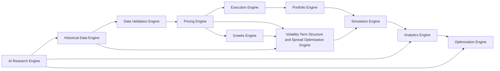
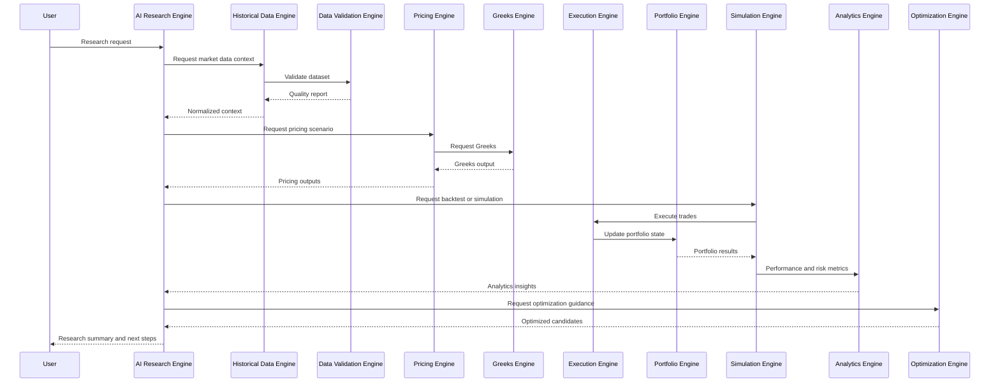

# Core Engine Architecture

## Overview

This document defines the quantitative platform as a collection of independent engines that collaborate through well-defined interfaces. Each engine owns a specific domain of responsibility, can evolve independently, and contributes to a unified research and execution workflow.

This document serves as the master architecture for the quantitative platform and should guide subsystem design, implementation planning, and integration testing.

## Architectural Principles

- Each engine is independently deployable and testable.
- Engines exchange data through explicit contracts rather than shared mutable state.
- The platform supports both research and production workflows through the same engine boundaries.
- Reproducibility, validation, and observability are first-class concerns.
- The architecture is extensible for new data providers, pricing models, strategies, and reporting modules.
- Frontend remains an independent client layer and never embeds quantitative engine logic.

Frontend architecture references:

- [10_GUI_Design.md](./10_GUI_Design.md)
- [38_GUI_Architecture.md](./38_GUI_Architecture.md)
- [45_Workspace.md](./45_Workspace.md)
- [48_Plugins.md](./48_Plugins.md)

## High-Level Engine Topology

## Engine Catalog

### 1. Historical Data Engine

#### Purpose
Provide normalized historical market data for options, equities, corporate actions, and market events.

#### Responsibilities
- Ingest market data from provider adapters.
- Normalize timestamps, symbols, and data structures.
- Store and retrieve historical datasets.
- Manage snapshots, replay windows, and versioned data sets.
- Surface event calendars and corporate actions.

#### Inputs
- Raw provider feeds
- Vendor-specific snapshots and archives
- Corporate action data
- Event calendars
- Configuration for symbol universes and time ranges

#### Outputs
- Canonical historical datasets
- Replay-ready time series
- Event and corporate action records
- Dataset metadata and provenance

#### Internal modules
- Ingestion service
- Normalization pipeline
- Snapshot manager
- Replay indexer
- Event calendar manager
- Catalog and metadata store

#### Public interfaces
- `load_historical_data(symbols, start, end, fields)`
- `get_replay_window(symbol, start, end)`
- `get_event_calendar(start, end)`
- `get_corporate_actions(symbol, start, end)`

#### Dependencies
- Data provider adapters
- Storage layer
- Validation engine
- Configuration service

#### Sprint 2 implementation status
- Provider abstraction and registry are implemented under [backend/data/providers](../backend/data/providers).
- Placeholder providers for ORATS, Databento, Polygon, and CBOE are scaffolded and raise a documented NotImplementedError for vendor-specific work.
- The cache manager and validation engine provide a production-ready foundation for future ingestion and normalization layers.

#### Error handling
- Missing or partial data should be marked with explicit quality flags.
- Data gaps should be surfaced without silently filling them.
- Provider-specific errors should be wrapped with contextual diagnostics.

#### Performance goals
- Support large historical datasets with low-latency retrieval for replay workloads.
- Minimize ingestion and normalization overhead for batch operations.

#### Testing requirements
- Unit tests for normalization logic.
- Integration tests for provider ingestion.
- Replay consistency tests.
- Validation tests for data completeness and timestamps.

---

### 2. Data Validation Engine

#### Purpose
Ensure the integrity, consistency, and quality of market data and derived research inputs.

#### Responsibilities
- Validate timestamps, symbol formatting, and data completeness.
- Detect anomalies, duplicates, and missing values.
- Enforce schema and business-rule checks.
- Tag datasets with quality metadata.
- Provide rejection or quarantine workflows for bad data.

#### Inputs
- Historical datasets
- Raw provider payloads
- Configuration rules
- Reference data

#### Outputs
- Validated datasets
- Quality reports
- Error and warning logs
- Quarantine records

#### Internal modules
- Schema validator
- Range and consistency checks
- Anomaly detector
- Quality scoring module
- Quarantine manager

#### Public interfaces
- `validate_dataset(dataset)`
- `validate_symbol_series(symbol, series)`
- `get_quality_report(dataset_id)`
- `quarantine_records(criteria)`

#### Dependencies
- Historical Data Engine
- Configuration service
- Storage layer

#### Error handling
- Invalid records should be isolated without halting full validation.
- Validation failures should return actionable diagnostics.
- Critical schema breaks should be surfaced to operators.

#### Performance goals
- Process large datasets efficiently with batch validation support.
- Provide rapid feedback for interactive research workloads.

#### Testing requirements
- Fixture-based validation tests.
- Regression tests for schema changes.
- Fuzz tests for malformed inputs.
- Performance benchmarks for large data batches.

---

### 3. Pricing Engine

#### Purpose
Price options and related instruments under a variety of market assumptions and models.

#### Responsibilities
- Evaluate option prices based on market inputs and model assumptions.
- Support multiple pricing models and calibration settings.
- Provide price surfaces and scenario-based prices.
- Produce pricing outputs for backtests, analytics, and validation workflows.

#### Inputs
- Underlying price data
- Volatility surfaces and assumptions
- Interest rates and dividends
- Exercise style and model configuration
- Option terms and market conventions

#### Outputs
- Option price estimates
- Price surfaces
- Scenario-based valuation outputs
- Model diagnostics

#### Internal modules
- Model registry
- Calibration engine
- Surface interpolator
- Model evaluator
- Sensitivity calculator

#### Public interfaces
- `price_option(option, context)`
- `price_surface(options, context)`
- `calibrate_model(model, data)`
- `get_model_diagnostics(model_id)`

#### Dependencies
- Historical Data Engine
- Greeks Engine
- Configuration service
- Validation Engine

#### US listed options compatibility notes
- Contract-aware routing is metadata-driven (exercise, settlement, underlying, dividend conventions).
- Black-Scholes is restricted to European spot contexts.
- Black-76 is used for European futures options.
- American equity/ETF options default to CRR with node-wise early-exercise checks.

#### Error handling
- Invalid model inputs should fail early with clear diagnostics.
- Unsupported model configurations should be rejected explicitly.
- Numerical instability should be flagged and logged.

#### Performance goals
- Deliver prices rapidly for large option universes and batch runs.
- Maintain numerical stability for standard and exotic scenarios.

#### Testing requirements
- Unit tests for pricing formulas.
- Cross-model validation tests.
- Sensitivity and stress tests.
- Benchmark tests against reference implementations.

---

### 4. Greeks Engine

#### Purpose
Compute option Greeks and related sensitivities for risk analysis and strategy evaluation.

Implementation details are documented in [Greeks Engine](./33_Greeks_Engine.md).

#### Responsibilities
- Calculate delta, gamma, vega, theta, rho, and related measures.
- Support scenario-based sensitivity analysis.
- Produce Greeks for portfolios, strategies, and individual legs.
- Provide consistent outputs for analytics and reports.

#### Inputs
- Pricing context
- Option terms
- Market inputs and model assumptions
- Portfolio or strategy definitions

#### Outputs
- Greeks vectors
- Sensitivity reports
- Aggregate portfolio Greeks
- Scenario sensitivity outputs

#### Internal modules
- Greeks calculator
- Aggregation layer
- Scenario sensitivity module
- Report formatter

#### Public interfaces
- `calculate_greeks(option, context)`
- `calculate_strategy_greeks(strategy, context)`
- `calculate_portfolio_greeks(portfolio, context)`

#### Dependencies
- Pricing Engine
- Portfolio Engine
- Configuration service

#### Error handling
- Handle unsupported option styles or missing inputs gracefully.
- Return structured error states for invalid or incomplete calculations.
- Flag instability or convergence problems.

#### Performance goals
- Compute Greeks for large portfolios quickly and deterministically.
- Maintain low overhead for repeated calculations across many scenarios.

#### Testing requirements
- Unit tests for each Greek.
- Portfolio aggregation tests.
- Numerical consistency tests versus pricing outputs.
- Edge-case tests for near-expiry and deep ITM/OTM scenarios.

---

### Planned Engine: Volatility Term Structure and Spread Optimisation Engine

#### Purpose
Provide a research-focused subsystem for volatility term-structure analytics, multi-expiry spread evaluation, and parameter optimization under realistic and bias-safe assumptions.

#### Scope note
Sprint 3C contains documentation and architecture planning only. Production implementation is deferred.

#### Planned responsibilities
- Build historical volatility observations by symbol, strike, tenor, and timestamp.
- Compute realised and historical volatility windows.
- Build and classify implied-volatility term structures including contango/backwardation, slope, curvature, and front/back relationships.
- Compute forward implied volatility and construct volatility surfaces/skew analytics.
- Run earnings-aware and event-aware term-structure analysis.
- Analyze calendar/diagonal/double-calendar/double-diagonal structures and related multi-expiry spreads.
- Estimate historical and model-based probability of profit, expected value, and risk-adjusted performance.
- Perform parameter optimization with walk-forward and out-of-sample validation.
- Run volatility regime analysis and integrate findings into simulation research workflows.

#### Planned no-look-ahead controls
- Features must only use records at or before decision timestamp.
- Event-aware logic must use announcement timestamps.
- Walk-forward must separate train and validation windows.
- Optimization must not access out-of-sample windows during search.

Contango and backwardation are research features and entry filters, not guaranteed profit signals.

#### Roadmap dependency
Planned after completion of the historical database foundation, pricing engine core, and Greeks engine core.

---

### 5. Execution Engine

#### Purpose
Model trade execution, transaction cost assumptions, and order handling behavior.

#### Responsibilities
- Simulate fills, slippage, partial fills, commissions, fees, and assignment events.
- Support configurable fill models and execution assumptions.
- Evaluate early assignment, American exercise, and corporate action impacts.
- Track order-level and trade-level execution results.

#### Inputs
- Orders and strategy actions
- Market data and liquidity assumptions
- Fill model configuration
- Commission and fee rules
- Assignment and exercise rules

#### Outputs
- Filled orders
- Execution reports
- Transaction costs
- Assignment and exercise events
- Order status updates

#### Internal modules
- Order router
- Fill model engine
- Cost calculator
- Assignment simulator
- Exercise handler
- Order lifecycle manager

#### Public interfaces
- `submit_order(order)`
- `simulate_fill(order, market_context)`
- `calculate_transaction_costs(trade)`
- `process_assignment(event)`

#### Dependencies
- Pricing Engine
- Historical Data Engine
- Portfolio Engine
- Configuration service

#### Error handling
- Invalid order specifications should be rejected with clear reasons.
- Missing liquidity information should be handled by fallback fill assumptions.
- Execution anomalies should be logged and visible in reports.

#### Performance goals
- Support high-throughput simulation and event processing.
- Keep execution logic deterministic for backtests.

#### Testing requirements
- Unit tests for fill logic.
- Scenario tests for partial fills and slippage.
- Assignment and exercise tests.
- Regression tests for fee and commission rules.

---

### 6. Portfolio Engine

#### Purpose
Track holdings, cash balances, margins, buying power, and portfolio-level risk and performance.

#### Responsibilities
- Maintain portfolio state and position records.
- Update cash and margin based on trades and corporate actions.
- Evaluate portfolio-level metrics and risk exposure.
- Support portfolio rebalancing and scenario views.

#### Inputs
- Order fills and trade events
- Cash and account configuration
- Position and holdings data
- Margin and buying power rules
- Corporate action events

#### Outputs
- Portfolio state
- Position summaries
- Cash and margin reports
- Risk and performance snapshots

#### Internal modules
- Position manager
- Cash manager
- Margin calculator
- Performance aggregator
- Corporate action processor

#### Public interfaces
- `apply_trade(trade)`
- `get_portfolio_state()`
- `calculate_buying_power()`
- `calculate_margin_requirements()`

#### Dependencies
- Execution Engine
- Pricing Engine
- Greeks Engine
- Configuration service

#### Error handling
- Invalid state transitions should be prevented and logged.
- Margin or cash violations should be represented explicitly.
- Portfolio reconciliation issues should be surfaced.

#### Performance goals
- Manage large portfolios efficiently across many time steps.
- Support rapid portfolio revaluation and reconciliation.

#### Testing requirements
- Unit tests for trade application.
- Margin and cash tests.
- Reconciliation tests.
- Stress tests for large portfolios.

---

### 7. Simulation Engine

#### Purpose
Replay strategies, scenarios, and market regimes over historical or synthetic conditions.

#### Responsibilities
- Run backtests and scenario analyses.
- Reproduce market paths and event sequences.
- Provide deterministic and stochastic simulation modes.
- Generate trade, performance, and risk output for research workflows.

#### Inputs
- Historical data
- Strategy definitions
- Execution assumptions
- Simulation settings and random seed
- Scenario parameters

#### Outputs
- Simulation results
- Trade logs
- Equity curves
- Scenario reports

#### Internal modules
- Backtest orchestrator
- Scenario generator
- Event scheduler
- Result aggregator
- Replay controller

#### Public interfaces
- `run_backtest(strategy, data, config)`
- `run_scenario(strategy, scenario, config)`
- `run_monte_carlo(strategy, config)`

#### Dependencies
- Historical Data Engine
- Execution Engine
- Portfolio Engine
- Analytics Engine
- Optimization Engine

#### Error handling
- Simulation failures should preserve partial results and diagnostics.
- Data availability problems should be surfaced clearly.
- Randomness should be controllable via seed management.

#### Performance goals
- Support large-scale backtests with configurable parallelism.
- Preserve reproducibility across runs.

#### Testing requirements
- Deterministic backtest tests.
- Monte Carlo stability tests.
- Replay correctness tests.
- Benchmark tests for performance and memory usage.

---

### 8. Analytics Engine

#### Purpose
Provide statistical and research analysis for strategy performance and market behavior.

#### Responsibilities
- Compute performance measures and risk metrics.
- Analyze volatility, correlation, beta, liquidity, and regime behavior.
- Support research notebooks and reporting workflows.
- Produce charts, summaries, and export-ready outputs.

#### Inputs
- Simulation outputs
- Market data
- Portfolio states
- Strategy and risk attributes

#### Outputs
- Performance metrics
- Risk reports
- Market regime insights
- Report-ready analytics artifacts

#### Internal modules
- Performance metrics module
- Risk analytics module
- Volatility and correlation module
- Liquidity scoring module
- Report generator

#### Public interfaces
- `compute_metrics(simulation_result)`
- `analyze_risk(portfolio_state)`
- `analyze_market_regimes(data)`
- `export_report(artifact, format)`

#### Dependencies
- Simulation Engine
- Portfolio Engine
- Pricing Engine
- Historical Data Engine

#### Error handling
- Missing metrics should be represented explicitly.
- Analytical failures should preserve raw data for inspection.
- Statistical assumptions should be documented in outputs.

#### Performance goals
- Produce analytics quickly for interactive exploration.
- Scale to large histories and many strategies.

#### Testing requirements
- Unit tests for each metric.
- Regression tests for report generation.
- Statistical sanity tests.
- Benchmark comparisons against reference calculations.

---

### 9. Optimization Engine

#### Purpose
Optimize parameters, search spaces, and strategy configurations using systematic methods.

#### Responsibilities
- Run grid search, random search, and walk-forward optimization.
- Evaluate parameter sets against objective functions.
- Support validation and out-of-sample testing.
- Report optimizer results and candidate parameter sets.

#### Inputs
- Strategy definitions
- Search spaces and constraints
- Historical data
- Objective functions and scoring rules
- Validation settings

#### Outputs
- Optimized parameter sets
- Search logs
- Validation results
- Candidate ranking and diagnostics

#### Internal modules
- Search strategy registry
- Objective evaluator
- Validation coordinator
- Result ranking module
- Parallel execution manager

#### Public interfaces
- `optimize(strategy, search_space, objective, config)`
- `run_grid_search(...)`
- `run_random_search(...)`
- `run_walk_forward(...)`

#### Dependencies
- Simulation Engine
- Analytics Engine
- Historical Data Engine

#### Error handling
- Invalid search spaces should be rejected early.
- Optimization failures should preserve intermediate results.
- Convergence and resource issues should be visible to users.

#### Performance goals
- Support efficient parameter sweeps with optional parallel execution.
- Minimize repeated computation where possible.

#### Testing requirements
- Unit tests for search strategies.
- Validation tests for objective evaluation.
- Sampling and reproducibility tests.
- Performance benchmarks for search workflows.

---

### 10. AI Research Engine

#### Purpose
Provide AI-assisted research, workflow guidance, and natural-language interaction for analysts and researchers.

#### Responsibilities
- Interpret user requests and map them to platform capabilities.
- Recommend research workflows and analysis steps.
- Assist in hypothesis generation, strategy exploration, and report drafting.
- Coordinate with other engines to retrieve context and present insights.

#### Inputs
- User prompts
- Research context
- Platform state and artifacts
- Historical and simulation data summaries

#### Outputs
- Research suggestions
- Analysis summaries
- Workflow guidance
- Draft reports and insights

#### Internal modules
- Intent parser
- Knowledge and workflow planner
- Context aggregator
- Insight synthesizer
- Response formatter

#### Public interfaces
- `process_research_request(prompt, context)`
- `suggest_next_steps(context)`
- `summarize_results(artifact)`
- `draft_research_note(context)`

#### Dependencies
- Analytics Engine
- Optimization Engine
- Historical Data Engine
- Simulation Engine
- Configuration service

#### Error handling
- Ambiguous prompts should return clarification requests.
- Missing context should be handled explicitly.
- AI-generated outputs should be clearly labeled as assistance rather than authority.

#### Performance goals
- Respond quickly for interactive research workflows.
- Maintain traceability to source data and engine outputs.

#### Testing requirements
- Prompt-to-action tests.
- Safety and policy tests.
- Context integration tests.
- Regression tests for response quality and grounding.

---

## Engine Communication Model

The engines communicate through event-driven messages, request/response contracts, and shared artifact models. The platform should ensure that each engine remains isolated while still producing a cohesive research workflow.

## Cross-Engine Data Contracts

The following shared contracts should be defined and versioned:

- MarketDataBundle
- ValidationReport
- PricingContext
- GreeksSnapshot
- ExecutionResult
- PortfolioSnapshot
- SimulationResult
- AnalyticsReport
- OptimizationResult
- ResearchInsight

## Reproducibility and Governance

Every engine should support:

- Versioned configuration
- Data provenance metadata
- Deterministic execution where possible
- Traceable outputs for audits and reproducibility
- Logging and diagnostics for debugging and validation

## Testing Strategy Across Engines

- Unit tests for module-level logic.
- Integration tests for engine-to-engine communication.
- End-to-end tests for research workflows.
- Regression tests for known-model behavior.
- Performance and benchmark tests for core execution paths.

## Conclusion

The platform architecture is defined as a set of independent engines with clear responsibilities, interfaces, dependencies, and validation requirements. This design enables modular development, flexible extension, and robust quantitative research workflows while preserving a coherent user experience.
