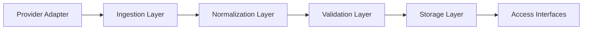

# Historical Data Engine

## Purpose

The Historical Data Engine provides a normalized, reproducible, and versioned view of market data for research, backtesting, and validation workflows.

## Responsibilities

- Ingest historical market data from provider adapters.
- Normalize data into a canonical internal format.
- Track provenance, snapshot metadata, and versioning.
- Support replay windows, event calendars, and corporate actions.
- Expose data access interfaces for downstream engines.

## Inputs

- Raw provider snapshots and archives
- Corporate-action feeds
- Event calendar data
- Configuration for symbols, date ranges, and fields
- Reference data such as contract specifications

## Outputs

- Canonical historical datasets
- Replay-ready market data windows
- Event and corporate-action records
- Dataset quality summaries and metadata

## Interfaces

- `load_symbol_history(symbol, start, end, fields)`
- `load_option_chain(symbol, as_of_date)`
- `get_replay_window(symbol, start, end)`
- `get_event_calendar(start, end)`
- `get_corporate_actions(symbol, start, end)`

## Data Models

- `MarketDataPoint`
- `OptionChainSnapshot`
- `CorporateAction`
- `EventCalendarEntry`
- `DataSetMetadata`

## Error Handling

- Missing values should be surfaced with explicit quality flags.
- Provider failures should be wrapped with contextual diagnostics.
- Partial or inconsistent data should be quarantined and surfaced rather than silently accepted.

## Sprint 2 Foundation Delivered

The first production framework for the historical-data subsystem is now implemented in [backend/data](../backend/data):

- provider interfaces, registry, metadata, and custom exceptions
- placeholder providers for ORATS, Databento, Polygon, and CBOE
- a filesystem-backed cache manager with metadata, versioning, expiry, and integrity hashes
- a validation engine that returns structured reports for duplicate, missing, invalid, and malformed records
- unit tests for provider discovery, provider contracts, caching, and validation workflow

## Validation Rules

- Timestamps must be monotonic within each symbol series.
- Symbols must resolve to known instrument identifiers.
- Required fields must be present for requested data windows.
- Corporate actions must not conflict with existing event records.

## Performance Targets

- Support large historical datasets efficiently.
- Provide rapid access for replay and batch analytics workloads.
- Minimize repeated normalization work through caching and indexing.

## Testing Requirements

- Unit tests for normalization and parsing logic.
- Integration tests for provider ingestion.
- Replay consistency tests.
- Validation tests for missing and malformed data.

## Mermaid Diagram

