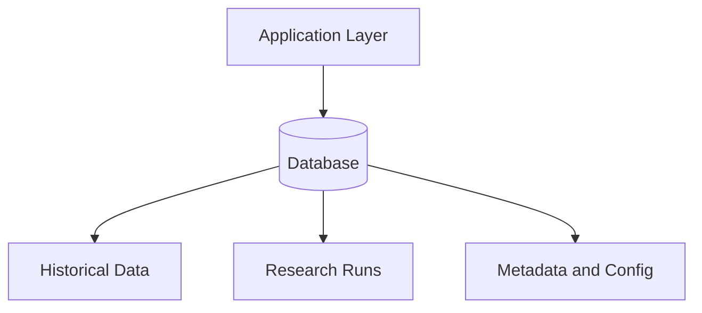

# Database Architecture

## Purpose

The Database Architecture defines the storage strategy for market data, research artifacts, simulation outputs, and configuration metadata.

## Responsibilities

- Store historical market data and reference data.
- Persist research runs, simulations, and experiment metadata.
- Maintain configuration and versioning records.
- Support reproducible workflows and auditability.
- Enable efficient retrieval for replay, analytics, and reporting.

## Inputs

- Research data from the Historical Data Engine
- Simulation outputs from the Simulation Engine
- Configuration values from the platform runtime
- User-created research artifacts and reports

## Outputs

- Queryable datasets and snapshots
- Experiment and run histories
- Metadata and provenance records
- Export-ready artifacts

## Interfaces

- `store_dataset(dataset)`
- `load_dataset(dataset_id)`
- `save_run_metadata(run_id, metadata)`
- `load_run_results(run_id)`
- `list_available_snapshots()`
- `batch_upsert_contracts(records)`
- `batch_upsert_quotes(records)`
- `query_quotes(contract_id, start_ts, end_ts)`
- `batch_upsert_manifests(records)`
- `insert_lineage(records)`

## Data Models

- `DatasetRecord`
- `DatasetManifestRecord`
- `DatasetLineageRecord`
- `RunMetadata`
- `ConfigurationSnapshot`
- `SimulationArtifact`
- `ResearchNote`

## Sprint 3A Implementation

Implemented in `backend/database`:

- SQLAlchemy 2.x typed models for providers, manifests, underlyings, exchanges/calendars, option contracts/quotes, underlying prices, dividends, earnings events, corporate actions, rate curves, and lineage records.
- Engine/session management for SQLite and PostgreSQL-ready URLs via environment configuration.
- Repository layer supporting batch insertion/upsert, lookups, and date-range query patterns.
- Alembic migration scaffolding with an initial schema migration.
- Deterministic offline tests for schema, constraints, relationships, rollback behavior, duplicate handling, and nullable vendor data.

## Sprint 3B Implementation

Implemented service-layer extensions in `backend/database`:

- Provider-neutral ingestion DTOs for all core historical dataset entities.
- Batch ingestion services with configurable batch size, explicit upsert policy modes, deterministic duplicate handling, validation-first writes, and structured import results.
- Historical query services for option-chain snapshots, contract range filters, quote ranges, nearest-prior as-of lookups, underlying history, event ranges, corporate actions, and interest-rate curves.
- As-of rules enforcing no future lookups and exposing stale data age for nearest-prior results.
- Deterministic offline tests for ingestion, rollback safety, duplicate handling, upserts, as-of and no-look-ahead behavior, stale data reporting, and validation failures.

## Sprint 3C Implementation

Implemented reproducibility and corporate-action extension modules in `backend/database`:

- New persistence models for raw vendor records, normalized corporate actions, symbol history, adjusted research views, immutable snapshots, snapshot-source lineage, and audit events.
- Corporate-action service with explicit adjustment policies for split/dividend/contract-adjustment behavior and warning emission for incomplete actions.
- Knowledge policies supporting both effective-date semantics and announcement-aware no-look-ahead enforcement.
- Snapshot service supporting create/get/verify/compare workflows and explicit mutation rejection.
- Audit event service for immutable event recording and filtered retrieval.
- Deterministic offline tests validating forward/reverse split behavior, incomplete-action warnings, symbol history resolution, snapshot verification/comparison, immutability, and audit persistence.

## Sprint 4D Implementation

Implemented volatility analytics storage extensions in `backend/database`:

- volatility observation persistence with deterministic upsert behavior
- volatility time-slice persistence with node-level storage
- immutable slice finalization and mutation rejection after finalization
- no-look-ahead nearest-prior finalized-surface lookup paths
- query-service methods for smile, term, surface, and historical slice retrieval workflows

## Historical Data Metadata Strategy

- Store a deterministic manifest for each ingested dataset version containing provider, dataset version, schema version, symbol scope, date range, checksum, row count, and source metadata.
- Persist lineage and audit events for imports, transformations, validation outcomes, timestamps, and software version.
- Redact credential-like fields from persisted lineage metadata and logs.
- Link data payload records to manifest checksum values to support integrity verification and cache/database consistency checks.

## Error Handling

- Storage failures should be surfaced with explicit errors and retry guidance.
- Corrupt or partially written records should be detected and quarantined.
- Schema changes should be versioned and validated before deployment.

## Validation Rules

- Primary keys must be unique and immutable where required.
- Timestamps must be stored consistently in UTC where appropriate.
- Metadata must include provenance and version information.
- Data writes must preserve referential integrity.

## Performance Targets

- Support high-throughput ingestion for historical and simulation datasets.
- Enable efficient time-range querying for replay workloads.
- Keep metadata access low latency for interactive research workflows.

## Testing Requirements

- Unit tests for persistence and query logic.
- Migration tests for schema changes.
- Integration tests for end-to-end storage workflows.
- Performance tests for large dataset access.

## Mermaid Diagram

## Sprint 5D Portfolio Storage Layer

Portfolio allocation runs are now persisted as normalized run artifacts.

- DTOs, ORM entities, repositories, and persistence service are implemented under `backend/database`.
- Migration `0007_portfolio_selection_foundation` defines the portfolio schema foundation.
- Run-level metadata validation prevents incomplete reproducibility records from being committed.