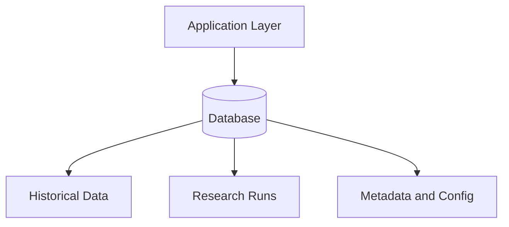

# Database Architecture

## Purpose

The Database Architecture defines the storage strategy for market data, research artifacts, simulation outputs, and configuration metadata.

## Responsibilities

- Store historical market data and reference data.
- Persist research runs, simulations, and experiment metadata.
- Maintain configuration and versioning records.
- Support reproducible workflows and auditability.
- Enable efficient retrieval for replay, analytics, and reporting.

## Inputs

- Research data from the Historical Data Engine
- Simulation outputs from the Simulation Engine
- Configuration values from the platform runtime
- User-created research artifacts and reports

## Outputs

- Queryable datasets and snapshots
- Experiment and run histories
- Metadata and provenance records
- Export-ready artifacts

## Interfaces

- `store_dataset(dataset)`
- `load_dataset(dataset_id)`
- `save_run_metadata(run_id, metadata)`
- `load_run_results(run_id)`
- `list_available_snapshots()`

## Data Models

- `DatasetRecord`
- `RunMetadata`
- `ConfigurationSnapshot`
- `SimulationArtifact`
- `ResearchNote`

## Error Handling

- Storage failures should be surfaced with explicit errors and retry guidance.
- Corrupt or partially written records should be detected and quarantined.
- Schema changes should be versioned and validated before deployment.

## Validation Rules

- Primary keys must be unique and immutable where required.
- Timestamps must be stored consistently in UTC where appropriate.
- Metadata must include provenance and version information.
- Data writes must preserve referential integrity.

## Performance Targets

- Support high-throughput ingestion for historical and simulation datasets.
- Enable efficient time-range querying for replay workloads.
- Keep metadata access low latency for interactive research workflows.

## Testing Requirements

- Unit tests for persistence and query logic.
- Migration tests for schema changes.
- Integration tests for end-to-end storage workflows.
- Performance tests for large dataset access.

## Mermaid Diagram

