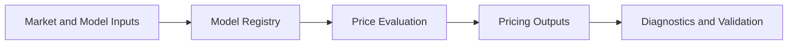

# Pricing Engine

## Purpose

The Pricing Engine estimates option and instrument values under defined market assumptions and model configurations.

## Responsibilities

- Price options and related instruments.
- Support multiple pricing models and calibration strategies.
- Generate price surfaces and scenario-based valuations.
- Provide pricing outputs for analytics, backtests, and validation workflows.

## Inputs

- Underlying price series
- Volatility assumptions and surfaces
- Interest rates and dividend assumptions
- Contract specifications and exercise conventions
- Model configuration and calibration data

## Outputs

- Option price estimates
- Price surfaces and scenario outputs
- Model diagnostics and calibration summaries

## Interfaces

- `price_option(option, context)`
- `price_surface(options, context)`
- `calibrate_model(model, data)`
- `get_model_diagnostics(model_id)`

## Data Models

- `PricingContext`
- `OptionPrice`
- `PriceSurfacePoint`
- `ModelConfiguration`
- `ModelDiagnostics`

## Error Handling

- Invalid or incomplete inputs should fail clearly and explain the issue.
- Unsupported model configurations should be rejected with structured diagnostics.
- Numerical instability should be surfaced as a model warning rather than silently ignored.

## Validation Rules

- Inputs must satisfy contract and model-specific requirements.
- Prices should be consistent with the chosen model assumptions.
- Calibration output must remain within declared bounds and constraints.

## Performance Targets

- Support pricing for large option universes efficiently.
- Maintain stable performance for batch and scenario-based evaluation.
- Support rapid recalculation for interactive research workloads.

## Testing Requirements

- Unit tests for pricing math and edge cases.
- Cross-model comparison tests.
- Calibration validation tests.
- Benchmark tests against known reference calculations.

## Mermaid Diagram

