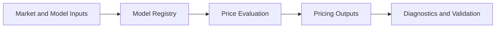

# Pricing Engine

## Purpose

The Pricing Engine estimates option and instrument values under defined market assumptions and model configurations.

## Responsibilities

- Price options and related instruments.
- Support multiple pricing models and calibration strategies.
- Generate price surfaces and scenario-based valuations.
- Provide pricing outputs for analytics, backtests, and validation workflows.

## Inputs

- Underlying price series
- Volatility assumptions and surfaces
- Interest rates and dividend assumptions
- Contract specifications and exercise conventions
- Model configuration and calibration data

## Outputs

- Option price estimates
- Price surfaces and scenario outputs
- Model diagnostics and calibration summaries

## Interfaces

- `price_option(option, context)`
- `price_surface(options, context)`
- `calibrate_model(model, data)`
- `get_model_diagnostics(model_id)`

## Sprint 4A Implementation Status

Implemented provider-neutral pricing framework in `backend/pricing` with:

- typed request and result contracts
- model interfaces and pricing engine dispatch
- strict input validation for spot, strike, volatility, expiry, dates, and style support
- placeholder model registrations for:
    - Black-76
    - Binomial Tree
    - Cox-Ross-Rubinstein
    - Barone-Adesi-Whaley
    - Bjerksund-Stensland
- full initial implementation for Black-Scholes only

## Sprint 4B Extension

The pricing framework is now extended by a provider-neutral Greeks subsystem in `backend/greeks` with analytic Black-Scholes Greeks, finite-difference verification, batch processing, and portfolio/multi-leg aggregation.

See [Greeks Engine](./27_Greeks_Engine.md).

## Sprint 4C Extension

The pricing framework is now extended with a provider-neutral implied-volatility subsystem in `backend/implied_volatility`.

Implemented capabilities:

- IV solving via Newton-Raphson
- bisection fallback when Newton does not converge
- Brent solver adapter interface for pluggable root-finding integration
- convergence and failure-handling controls
- smile, term-structure, and surface interpolation
- volatility cube framework
- historical IV storage hooks

See [Implied Volatility Engine](./28_Implied_Volatility_Engine.md).

No live API integrations are used in this sprint.

### Pricing Input Contract

- spot
- strike
- expiry
- volatility
- risk-free rate
- dividend yield
- option type
- exercise style
- multiplier
- valuation date

### Pricing Output Contract

- option value
- intrinsic value
- extrinsic value
- time to expiry
- calculation metadata
- warnings

## Planned Integration: Volatility Term Structure and Spread Optimisation Engine

The planned volatility term-structure subsystem depends on Pricing Engine outputs for model-consistent valuation and probability workflows.

- Provide pricing-context snapshots suitable for historical as-of replay.
- Support valuation inputs used by model-estimated probability of profit and expected-value calculations.
- Expose diagnostics required by spread optimization and walk-forward validation.
- Preserve timestamp-safe interfaces to prevent look-ahead leakage in downstream analytics.

This integration is roadmap scope only and not implemented during Sprint 3C.

## Data Models

- `PricingContext`
- `OptionPrice`
- `PriceSurfacePoint`
- `ModelConfiguration`
- `ModelDiagnostics`

## Error Handling

- Invalid or incomplete inputs should fail clearly and explain the issue.
- Unsupported model configurations should be rejected with structured diagnostics.
- Numerical instability should be surfaced as a model warning rather than silently ignored.

## Validation Rules

- Inputs must satisfy contract and model-specific requirements.
- Prices should be consistent with the chosen model assumptions.
- Calibration output must remain within declared bounds and constraints.

## Performance Targets

- Support pricing for large option universes efficiently.
- Maintain stable performance for batch and scenario-based evaluation.
- Support rapid recalculation for interactive research workloads.

## Testing Requirements

- Unit tests for pricing math and edge cases.
- Cross-model comparison tests.
- Calibration validation tests.
- Benchmark tests against known reference calculations.

## Mermaid Diagram

