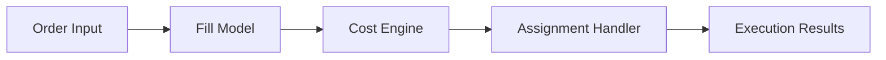

# Execution Engine

## Purpose

The Execution Engine models trade execution, transaction costs, and fill behavior for research and backtesting workflows.

## Responsibilities

- Simulate orders and fills.
- Apply slippage, partial fills, commissions, and exchange fees.
- Model assignment, exercise, and early exercise events.
- Track transaction-level outcomes for downstream portfolio and analytics engines.

## Inputs

- Orders and strategy actions
- Market price and liquidity assumptions
- Fill model configuration
- Commission and fee rules
- Assignment and exercise rules

## Outputs

- Trade execution records
- Fill and cost summaries
- Assignment and exercise events
- Order status and reconciliation outputs

## Interfaces

- `submit_order(order)`
- `simulate_fill(order, market_context)`
- `calculate_transaction_costs(trade)`
- `process_assignment(event)`

## Data Models

- `Order`
- `FillRecord`
- `ExecutionResult`
- `CostBreakdown`
- `AssignmentEvent`

## Error Handling

- Invalid order inputs should be rejected with structured diagnostic information.
- Missing market liquidity data should trigger default fill assumptions with warnings.
- Execution anomalies should be logged and exposed in result summaries.

## Validation Rules

- Orders must satisfy valid quantity, symbol, and side conventions.
- Fill assumptions must respect configured slippage and partial fill policies.
- Cost calculations must reconcile with configured fee and commission rules.

## Performance Targets

- Support high-throughput trade simulation for backtests and scenarios.
- Maintain deterministic behavior for reproducible research runs.
- Scale to large order sets without excessive overhead.

## Testing Requirements

- Unit tests for fill and cost logic.
- Scenario tests for slippage and partial fills.
- Assignment and exercise regression tests.
- Backtest integration tests with portfolio updates.

## Mermaid Diagram

