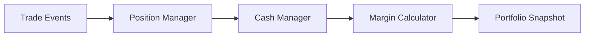

# Portfolio Engine

## Purpose

The Portfolio Engine maintains portfolio state, cash balances, margin requirements, buying power, and portfolio-level risk and performance metrics.

## Responsibilities

- Track positions and holdings.
- Update cash balances and margin requirements after trades and events.
- Monitor buying power and portfolio constraints.
- Support performance and risk snapshots across time.

## Inputs

- Trade executions and fills
- Cash and account configuration
- Position snapshots
- Margin and buying-power rules
- Corporate-action and assignment events

## Outputs

- Portfolio state and position summaries
- Cash and margin reports
- Buying power calculations
- Performance and risk snapshots

## Interfaces

- `apply_trade(trade)`
- `get_portfolio_state()`
- `calculate_buying_power()`
- `calculate_margin_requirements()`

## Data Models

- `PortfolioState`
- `Position`
- `CashBalance`
- `MarginRequirement`
- `PortfolioSnapshot`

## Error Handling

- State transitions must be validated before applying updates.
- Cash or margin violations should be represented explicitly.
- Reconciliation inconsistencies should be surfaced to users and logs.

## Validation Rules

- Positions must reconcile with trade and assignment history.
- Cash balances must remain consistent with trade and interest events.
- Margin calculations must honor configured rules and constraints.

## Performance Targets

- Support rapid updating and revaluation across large portfolios.
- Deliver low-latency portfolio queries for interactive research.
- Scale to multi-strategy and multi-account workflows.

## Testing Requirements

- Unit tests for trade application and state updates.
- Margin and buying-power tests.
- Reconciliation and event-processing tests.
- Stress tests for large portfolios.

## Mermaid Diagram

