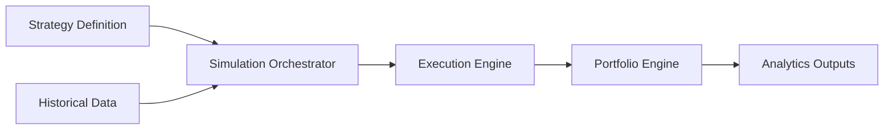

# Simulation Engine

## Purpose

The Simulation Engine runs historical and scenario-based simulations for strategies, portfolios, and market regimes.

## Responsibilities

- Replay strategies over historical data.
- Support deterministic and stochastic simulation modes.
- Generate trade logs, equity curves, and performance summaries.
- Coordinate with execution, portfolio, analytics, and optimization engines.

## Inputs

- Historical or synthetic market data
- Strategy definitions and parameters
- Execution and portfolio configuration
- Simulation settings and random seed
- Scenario and optimization constraints

## Outputs

- Simulation results
- Trade and order logs
- Equity curves and performance metrics
- Scenario reports and diagnostics

## Interfaces

- `run_backtest(strategy, data, config)`
- `run_scenario(strategy, scenario, config)`
- `run_monte_carlo(strategy, config)`

## Data Models

- `SimulationConfig`
- `SimulationResult`
- `TradeLogEntry`
- `EquityCurvePoint`
- `ScenarioDefinition`

## Error Handling

- Simulation failures should preserve partial output and diagnostics.
- Missing data should be flagged with explicit quality warnings.
- Randomness should remain reproducible through seed management.

## Validation Rules

- Inputs must be compatible with the selected simulation mode.
- Results must preserve reproducibility metadata.
- Scenario and backtest outputs must remain consistent with configured assumptions.

## Performance Targets

- Support large backtest workloads with controlled resource usage.
- Provide efficient batch execution for optimization and scenario analysis.
- Preserve deterministic behavior across repeated runs.

## Testing Requirements

- Deterministic backtest tests.
- Monte Carlo stability tests.
- Replay correctness tests.
- Integration tests for interaction with execution and portfolio engines.

## Mermaid Diagram

