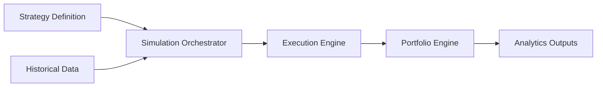

# Simulation Engine

## Purpose

The Simulation Engine runs historical and scenario-based simulations for strategies, portfolios, and market regimes.

## Responsibilities

- Replay strategies over historical data.
- Support deterministic and stochastic simulation modes.
- Generate trade logs, equity curves, and performance summaries.
- Coordinate with execution, portfolio, analytics, and optimization engines.
- Support planned volatility term-structure spread research with realistic execution assumptions.

## Inputs

- Historical or synthetic market data
- Strategy definitions and parameters
- Execution and portfolio configuration
- Simulation settings and random seed
- Scenario and optimization constraints

## Outputs

- Simulation results
- Trade and order logs
- Equity curves and performance metrics
- Scenario reports and diagnostics

## Interfaces

- `run_backtest(strategy, data, config)`
- `run_scenario(strategy, scenario, config)`
- `run_monte_carlo(strategy, config)`

## Data Models

- `SimulationConfig`
- `SimulationResult`
- `TradeLogEntry`
- `EquityCurvePoint`
- `ScenarioDefinition`

## Error Handling

- Simulation failures should preserve partial output and diagnostics.
- Missing data should be flagged with explicit quality warnings.
- Randomness should remain reproducible through seed management.

## Validation Rules

- Inputs must be compatible with the selected simulation mode.
- Results must preserve reproducibility metadata.
- Scenario and backtest outputs must remain consistent with configured assumptions.
- Simulation paths used for volatility-spread research must enforce no-look-ahead feature alignment.
- Execution assumptions must include realistic bid/ask, slippage, commissions, and liquidity constraints.

## Planned Integration: Volatility Term Structure and Spread Optimisation Engine

- Consume entry filters based on contango/backwardation, IV rank/percentile, realised/historical volatility, skew, and earnings/event timing.
- Evaluate exits based on profit target, loss limit, DTE, delta, IV change, term-structure normalization, and event timing.
- Support calendar, diagonal, double-calendar, and double-diagonal spread simulation paths.
- Support walk-forward and out-of-sample validation schedules produced by optimization workflows.

This integration is future roadmap scope and not implemented in Sprint 3C.

## Performance Targets

- Support large backtest workloads with controlled resource usage.
- Provide efficient batch execution for optimization and scenario analysis.
- Preserve deterministic behavior across repeated runs.

## Testing Requirements

- Deterministic backtest tests.
- Monte Carlo stability tests.
- Replay correctness tests.
- Integration tests for interaction with execution and portfolio engines.

## Mermaid Diagram

## Sprint 4F Additions: Probability and Lifecycle Simulation

Sprint 4F extends simulation workflows for research-only probability and lifecycle policy evaluation.

- Historical probability paths and model-estimated probability paths are reported as distinct labels.
- Model-estimated paths are seeded and deterministic for fixed inputs and seed.
- Per-leg repricing uses metadata-driven model routing; American-style legs use configured American models.
- No silent global fallback to Black-Scholes is allowed for mixed-style portfolios.
- Lifecycle trigger simulation is policy-driven and auditable (profit, loss, DTE, delta, IV change, term normalization, event timing, max holding period).

### Explicit Boundaries

- No live API connectivity.
- No broker connectivity.
- No live order execution.
- Benchmarks remain opt-in and are excluded from default `make test` runs.

## Sprint 5A Integration Notes

Simulation and optimization integration now follows a strict boundary:

- simulation remains the source of candidate metrics
- optimization orchestrates candidate ordering, constraints, objectives, and ranking
- failed candidate evaluations are isolated and retained as structured results
- no-look-ahead walk-forward split generation is handled by optimization hooks, not by live execution services

## Sprint 5D Portfolio Relationship

Simulation continues to provide historical performance and risk inputs consumed by portfolio allocation.

- Portfolio construction does not modify simulation assumptions.
- Portfolio scenarios are deterministic stress transforms on simulation-derived metrics.