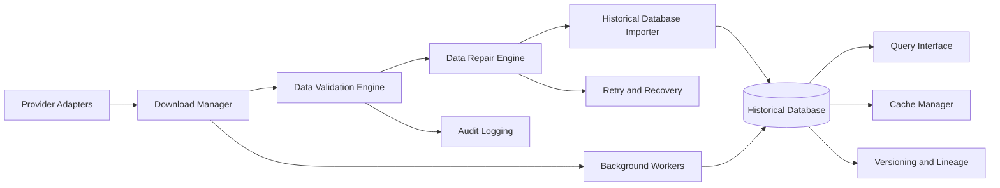
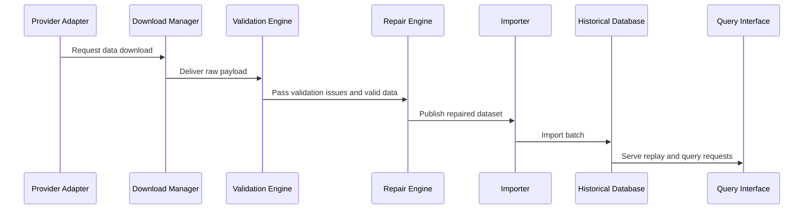

# Historical Data Platform Architecture

## Overview

The Historical Data Platform is the foundational data subsystem for the quantitative trading platform. It is responsible for acquiring, validating, repairing, storing, querying, and auditing market and reference data at the scale, quality, and reliability expected by a commercial research and trading environment.

This subsystem is designed to support multiple data providers, resilient ingestion workflows, historical replay, and strict reproducibility requirements for research and production use.

## Architectural Goals

- Provide a unified and provider-agnostic market-data layer.
- Ensure high data quality through validation, repair, lineage, and auditability.
- Support both batch and incremental data acquisition.
- Enable fast historical replay and research access.
- Scale to high-volume market data while remaining cost-efficient and operationally reliable.
- Preserve full provenance for all ingested and transformed data.

## Core Design Principles

- Provider independence through adapter interfaces.
- Event-driven ingestion with explicit retry and recovery policies.
- Immutable data artifacts with versioned snapshots.
- Strict validation before publication to the canonical store.
- Separation of ingestion, repair, storage, and query responsibilities.
- Operational observability through audit logs, metrics, and health checks.

## High-Level Architecture

## Subsystems

### 1. Provider Adapters

#### Purpose
Provide a unified integration layer for market data vendors and future providers.

#### Responsibilities
- Normalize provider-specific APIs, delivery formats, and authentication flows.
- Expose a common contract for downloads and metadata retrieval.
- Support provider-specific capabilities such as options chains, trades, quotes, and corporate actions.
- Allow future providers to be added without changing downstream subsystems.

#### Inputs
- Provider credentials and configuration
- Requested symbols, date ranges, and feed types
- Provider-specific endpoint and authentication settings

#### Outputs
- Raw data payloads
- Provider metadata and manifest records
- Download status and error conditions

#### Interfaces
- `fetch_data(request)`
- `get_metadata(request)`
- `list_available_symbols()`
- `get_provider_capabilities()`

#### Data Models
- `ProviderConfig`
- `DataRequest`
- `RawDataPayload`
- `ProviderStatus`

#### Error Handling
- Handle provider outages, throttling, rate limits, and authentication issues.
- Surface provider-specific failures as structured errors.
- Support partial failures and retryable conditions.

#### Validation Rules
- Response schema and authentication state must be validated before processing.
- Provider capabilities must match declared support.
- Unsupported symbol or date combinations must be rejected with explicit diagnostics.

#### Performance Targets
- Minimize latency for scheduled and ad hoc fetches.
- Support concurrent downloads across multiple providers.

#### Testing Requirements
- Unit tests for adapter contract adapters.
- Integration tests with sandbox or mock providers.
- Failure-case tests for throttling and authentication errors.

---

### 2. Download Manager

#### Purpose
Coordinate data acquisition workflows and orchestrate file and stream downloads.

#### Responsibilities
- Schedule downloads based on freshness requirements and priority.
- Manage concurrency, retries, and backoff policies.
- Track file integrity, completion states, and manifest references.
- Support both one-off and recurring ingestion jobs.

#### Inputs
- Download requests from provider adapters or scheduled jobs
- Network and storage constraints
- Retry policies and job priorities

#### Outputs
- Downloaded payloads and manifests
- Completion status and failure records
- Download diagnostics and metrics

#### Interfaces
- `enqueue_download(request)`
- `get_download_status(job_id)`
- `resume_download(job_id)`
- `cancel_download(job_id)`

#### Data Models
- `DownloadJob`
- `DownloadManifest`
- `DownloadStatus`
- `TransferMetric`

#### Error Handling
- Temporary network failures should be retried with exponential backoff.
- Corrupt or incomplete downloads should be requeued and quarantined.
- Job failures must include retry counts and last error details.

#### Validation Rules
- Download job payloads must contain valid request metadata.
- Checksum and size validation must be applied where available.
- Each job must produce a unique manifest entry.

#### Performance Targets
- Support parallelized ingestion pipelines.
- Keep queue latency low under normal operating conditions.

#### Testing Requirements
- Unit tests for scheduling and manifest handling.
- Integration tests for interrupted and resumed downloads.
- Load tests for concurrent queue processing.

---

### 3. Data Validation Engine

#### Purpose
Validate incoming data for correctness, completeness, and conformance before publication.

#### Responsibilities
- Enforce schema validation and business rules.
- Detect duplicates, anomalies, missing fields, and impossible values.
- Apply provider-specific validation logic where necessary.
- Generate validation reports used by downstream repair and publication processes.

#### Inputs
- Raw data payloads and manifests
- Provider metadata and reference data
- Validation rules and thresholds

#### Outputs
- Validation report
- Validated data records
- Rejection or quarantine records

#### Interfaces
- `validate_payload(payload, context)`
- `validate_series(series, rules)`
- `get_validation_report(record_id)`

#### Data Models
- `ValidationReport`
- `ValidationIssue`
- `ValidationRule`
- `QuarantineRecord`

#### Error Handling
- Invalid records should not be silently accepted.
- Validation failures should be grouped into actionable issues.
- Critical failures should halt publication to the canonical store.

#### Validation Rules
- Required fields must be present.
- Timestamp ordering must be consistent.
- Trade and quote data must satisfy range and consistency checks.
- Symbol normalization must be deterministic.

#### Performance Targets
- Validate large batches efficiently.
- Provide near real-time feedback for streaming or high-priority downloads.

#### Testing Requirements
- Unit tests for rule evaluation.
- Regression tests for schema changes.
- Property-based tests for invalid and edge-case data.

---

### 4. Data Repair Engine

#### Purpose
Repair data defects that are recoverable and consistent with the platform’s business rules.

#### Responsibilities
- Correct missing values, formatting issues, and small gaps where safe.
- Reconcile data with reference sources and corporate action records.
- Apply deterministic repair rules with clear provenance.
- Produce repair summaries for audit and review.

#### Inputs
- Validation results
- Raw payloads and partial datasets
- Reference and corporate-action data
- Repair policies and rule sets

#### Outputs
- Repaired datasets
- Repair audit log entries
- Repaired and unrepairable record classifications

#### Interfaces
- `repair_dataset(dataset, issues)`
- `apply_repair_rule(rule, record)`
- `get_repair_report(dataset_id)`

#### Data Models
- `RepairRule`
- `RepairAction`
- `RepairReport`
- `RepairOutcome`

#### Error Handling
- Unrepairable issues should be quarantined and flagged.
- Repair actions must preserve provenance and chain-of-custody.
- Repair confidence should be recorded for transparency.

#### Validation Rules
- Repairs must be deterministic and auditable.
- Repair actions must not alter the meaning of the underlying market event.
- All repairs must be traceable to source and rule.

#### Performance Targets
- Repair large batches while preserving data integrity.
- Support both batch repair and online repair workflows.

#### Testing Requirements
- Unit tests for every repair rule.
- Regression tests for known data defects.
- Replay tests to ensure repaired data remains consistent over time.

---

### 5. Cache Manager

#### Purpose
Accelerate repeated access to frequently used historical data and derived datasets.

#### Responsibilities
- Cache query results, time slices, and intermediate data products.
- Manage cache invalidation and refresh rules.
- Track hit rates and eviction policies.
- Support both memory and disk-backed cache tiers where appropriate.

#### Inputs
- Query requests and access patterns
- Dataset metadata and freshness information
- Cache policy configuration

#### Outputs
- Cached datasets and query results
- Cache usage statistics and eviction events

#### Interfaces
- `get_cached_result(key)`
- `store_result(key, result)`
- `invalidate(key)`
- `get_cache_stats()`

#### Data Models
- `CacheEntry`
- `CachePolicy`
- `CacheStats`

#### Error Handling
- Cache misses should fall back to canonical storage.
- Corrupt or stale cache entries should be invalidated automatically.
- Cache write failures should not break upstream queries.

#### Validation Rules
- Cache keys must be deterministic and versioned.
- Eviction policies must preserve correctness and freshness.
- Cache contents must be tied to source dataset versions.

#### Performance Targets
- Minimize query latency for repeated access patterns.
- Reduce storage and compute overhead for recurring workloads.

#### Testing Requirements
- Unit tests for invalidation and eviction logic.
- Performance tests for hit and miss paths.
- Consistency tests for versioned cache entries.

---

### 6. Historical Database Importer

#### Purpose
Publish validated and repaired data to the canonical historical store.

#### Responsibilities
- Load validated data into storage structures.
- Organize data by symbol, date, instrument type, and partition strategy.
- Preserve schema versioning and metadata for each imported batch.
- Maintain import manifests and batch histories.

#### Inputs
- Validated data sets and repair results
- Storage layout configuration
- Batch identifiers and source metadata

#### Outputs
- Imported historical records
- Import manifests and batch metadata
- Partitioned storage artifacts

#### Interfaces
- `import_batch(batch)`
- `rebuild_index(dataset_id)`
- `get_import_manifest(batch_id)`

#### Data Models
- `ImportBatch`
- `ImportManifest`
- `BatchMetadata`
- `PartitionDescriptor`

#### Error Handling
- Import failures must leave the system in a recoverable state.
- Partial imports should be rolled back or marked incomplete.
- Duplicate imports must be detected and prevented.

#### Validation Rules
- Imported data must match the target schema.
- Versioning metadata must be present for each batch.
- Partition assignment must be deterministic.

#### Performance Targets
- Support high-volume inserts and backfills efficiently.
- Minimize write amplification for large historical loads.

#### Testing Requirements
- Import integration tests.
- Rollback and partial-import tests.
- Partitioning and indexing tests.

---

### 7. Incremental Update Engine

#### Purpose
Keep historical data current through incremental updates from providers and internal sources.

#### Responsibilities
- Detect and fetch new data since the last successful ingestion.
- Apply incremental updates to the canonical store.
- Handle late-arriving data and backfills.
- Manage update windows and reprocessing policies.

#### Inputs
- Last successful ingestion state
- Provider availability and incremental feeds
- Data freshness and watermark settings

#### Outputs
- Incremental data updates
- Update manifests and status records
- Refresh and lag metrics

#### Interfaces
- `run_incremental_update()`
- `get_update_status()`
- `reprocess_window(start, end)`

#### Data Models
- `UpdateState`
- `IncrementalUpdate`
- `Watermark`
- `RefreshMetric`

#### Error Handling
- Update failures should preserve the last known good state.
- Late-arriving data should be merged using explicit rules.
- Reprocess requests should be isolated from normal updates.

#### Validation Rules
- Incremental updates must not create duplicates.
- Watermarks must advance monotonically.
- Update boundaries must be well-defined and auditable.

#### Performance Targets
- Keep lag low for active instruments and venues.
- Allow efficient incremental backfills for missed periods.

#### Testing Requirements
- Incremental update replay tests.
- Idempotency tests.
- Catch-up and backfill tests.

---

### 8. Query Interface

#### Purpose
Provide a consistent and efficient API for accessing historical and reference data.

#### Responsibilities
- Accept structured query requests from research, backtesting, and analytics systems.
- Resolve data against the correct versioned snapshots.
- Support time-range, symbol, and field selection.
- Present query results in canonical schemas.

#### Inputs
- Query requests and filters
- Requested version or snapshot context
- Access control and policy constraints

#### Outputs
- Query results
- Result metadata and provenance
- Error responses for invalid or unsupported queries

#### Interfaces
- `query_data(request)`
- `query_series(symbol, start, end, fields)`
- `query_option_chain(symbol, as_of_date)`

#### Data Models
- `QueryRequest`
- `QueryResult`
- `QueryMetadata`

#### Error Handling
- Invalid or unsupported queries should return structured errors.
- Missing data should be reported with context and quality metadata.
- Query timeout and resource limits should be enforced consistently.

#### Validation Rules
- Requested fields must exist in the schema.
- Date ranges must be valid and bounded.
- Version selection must resolve to a known snapshot.

#### Performance Targets
- Deliver results quickly for interactive research usage.
- Support large range scans and multi-symbol queries efficiently.

#### Testing Requirements
- Unit tests for query parsing and filtering.
- Integration tests for historical retrieval.
- Load tests for high-concurrency query usage.

---

### 9. Versioning

#### Purpose
Track data versions and preserve reproducibility for historical research.

#### Responsibilities
- Version every ingested batch and derived dataset.
- Support point-in-time and snapshot-based retrieval.
- Link versions to source providers, transformations, and repair histories.
- Enable reproducible replay and audit workflows.

#### Inputs
- Ingestion batches and transformations
- Dataset metadata and lineage information
- Snapshot and release configuration

#### Outputs
- Versioned datasets and snapshot manifests
- Version history and lineage records

#### Interfaces
- `create_snapshot(dataset_id)`
- `get_version(version_id)`
- `list_versions(dataset_id)`

#### Data Models
- `DataVersion`
- `SnapshotManifest`
- `VersionHistory`

#### Error Handling
- Version conflicts should be detected and surfaced.
- Failed snapshot creation should leave the earlier version intact.
- Referencing unknown versions should raise explicit errors.

#### Validation Rules
- Every published record must have a version association.
- Snapshot references must be immutable once published.
- Version ordering must remain consistent.

#### Performance Targets
- Support versioned reads and historical point-in-time queries efficiently.
- Minimize storage overhead for versioned snapshots.

#### Testing Requirements
- Version propagation tests.
- Snapshot consistency tests.
- Reproducibility tests for versioned retrieval.

---

### 10. Data Lineage

#### Purpose
Capture and preserve the provenance of every data record from source to consumption.

#### Responsibilities
- Record provider source, transformation steps, repair actions, and import events.
- Connect data records to their originating batch and version.
- Support audit and debugging workflows across the full pipeline.

#### Inputs
- Source record metadata
- Transformation logs
- Validation and repair outcomes
- Import and publication events

#### Outputs
- Lineage graphs and lineage summaries
- Provenance metadata for every dataset and record

#### Interfaces
- `get_lineage(record_id)`
- `trace_origin(record_id)`
- `build_lineage_graph(dataset_id)`

#### Data Models
- `LineageNode`
- `LineageEdge`
- `ProvenanceRecord`

#### Error Handling
- Missing lineage metadata should be flagged.
- Broken lineage chains should be surfaced as data-quality issues.
- Lineage generation failures should not block ingestion unless configured.

#### Validation Rules
- Every published record must reference an origin and transform path.
- Lineage must remain consistent after repairs and reimports.

#### Performance Targets
- Support lineage tracing for large datasets without excessive overhead.
- Preserve lineage metadata without excessive storage cost.

#### Testing Requirements
- Lineage graph tests.
- Provenance propagation tests.
- Regression tests for lineage breaks after repair operations.

---

### 11. Audit Logging

#### Purpose
Create an immutable operational trail for data ingestion, validation, repair, publication, and access.

#### Responsibilities
- Record lifecycle events for every significant operation.
- Support forensic analysis, alerting, and debugging.
- Preserve audit data independently from operational datasets.

#### Inputs
- System events and workflow transitions
- Data access and change actions
- Operational and security context

#### Outputs
- Audit logs and event records
- Alert and incident summaries

#### Interfaces
- `append_event(event)`
- `query_audit_log(filters)`
- `generate_audit_report(scope)`

#### Data Models
- `AuditEvent`
- `AuditFilter`
- `AuditReport`

#### Error Handling
- Logging failures should be non-blocking for primary data workflows where appropriate.
- Audit records must preserve critical context even when downstream systems fail.

#### Validation Rules
- Audit entries must include actor, timestamp, action, target, and outcome.
- Event ordering should remain consistent across services.

#### Performance Targets
- Handle high-volume events without materially affecting ingestion throughput.

#### Testing Requirements
- Unit tests for log formatting and retention policies.
- Integration tests for event propagation.
- Security tests for log access controls.

---

### 12. Corporate Actions

#### Purpose
Ingest and model corporate actions that affect option and equity data consistency.

#### Responsibilities
- Process dividends, splits, mergers, spin-offs, and other corporate events.
- Update historical series and option-chain context accordingly.
- Maintain corporate-action event records for replay and research.

#### Inputs
- Corporate-action feeds
- Provider announcements and reference data
- Historical series and instrument metadata

#### Outputs
- Corporate-action events
- Adjusted historical series and metadata

#### Interfaces
- `ingest_corporate_action(event)`
- `apply_corporate_actions(series, events)`
- `get_corporate_actions(symbol, range)`

#### Data Models
- `CorporateAction`
- `AdjustmentFactor`
- `EventImpact`

#### Error Handling
- Ambiguous or missing action details should be quarantined for review.
- Incompatible adjustments should be flagged explicitly.

#### Validation Rules
- Corporate actions must be consistent with the instrument’s effective dates.
- Adjustments must be applied in a deterministic order.

#### Performance Targets
- Process corporate actions rapidly for batch and event-driven updates.

#### Testing Requirements
- Unit tests for adjustment logic.
- Replay tests for historical series corrections.
- Edge-case tests for complex corporate events.

---

### 13. Dividends

#### Purpose
Track dividend events and their impact on option pricing and equity series.

#### Responsibilities
- Ingest dividend events and amounts.
- Apply dividend adjustments to relevant datasets.
- Expose dividends for research and pricing workflows.

#### Inputs
- Dividend feeds
- Corporate-action announcements
- Instrument metadata

#### Outputs
- Dividend event records
- Adjusted price series and model inputs

#### Interfaces
- `ingest_dividends(events)`
- `get_dividends(symbol, range)`
- `apply_dividend_adjustments(series, dividends)`

#### Data Models
- `DividendEvent`
- `DividendAdjustment`

#### Error Handling
- Missing or inconsistent dividend amounts should be surfaced.
- Late revisions should be handled through versioned updates.

#### Validation Rules
- Dividend dates must align with declared ex-dividend and payment schedules.
- Adjustments must not contradict corporate action rules.

#### Performance Targets
- Support low-latency access for active symbols.
- Efficiently apply dividends across large historical series.

#### Testing Requirements
- Unit tests for adjustment calculations.
- Regression tests for historical series updates.

---

### 14. Earnings

#### Purpose
Capture earnings events and maintain them as part of the research calendar and market event context.

#### Responsibilities
- Ingest earnings announcements and expected dates.
- Provide calendar views for research and event-driven workflows.
- Associate earnings events with pricing and volatility context.

#### Inputs
- Earnings calendar feeds
- Provider metadata and event schedules
- Research configuration

#### Outputs
- Earnings event records
- Calendar views and event summaries

#### Interfaces
- `ingest_earnings(events)`
- `get_earnings(symbol, range)`

#### Data Models
- `EarningsEvent`
- `EarningsCalendarEntry`

#### Error Handling
- Ambiguous or late-revised dates should be flagged.
- Partial event payloads should be captured with quality notices.

#### Validation Rules
- Event dates must be parsed consistently and stored with timezone context.
- Duplicate events must be rejected or merged deterministically.

#### Performance Targets
- Support event calendar retrieval for large symbol universes.

#### Testing Requirements
- Calendar parsing tests.
- Merge and deduplication tests.

---

### 15. Interest-Rate Curves

#### Purpose
Provide interest-rate curves and term-structure inputs for pricing and risk calculations.

#### Responsibilities
- Ingest and normalize curve data.
- Maintain curve versions and historical snapshots.
- Support interpolation and term-structure lookups.

#### Inputs
- Curve provider feeds
- Economic calendars and central-bank data
- Configuration for curve conventions and tenors

#### Outputs
- Interest-rate curve snapshots
- Interpolated rates and term-structure views

#### Interfaces
- `load_curve(as_of_date)`
- `get_rate(tenor, as_of_date)`
- `get_curve_snapshot(version_id)`

#### Data Models
- `InterestRateCurve`
- `CurvePoint`
- `CurveSnapshot`

#### Error Handling
- Missing tenors or invalid dates should be reported clearly.
- Curve updates should preserve versioning and history.

#### Validation Rules
- Curves must be internally consistent and sorted by tenor.
- Rate values must be within admissible ranges.

#### Performance Targets
- Support rapid curve lookup and interpolation.

#### Testing Requirements
- Unit tests for interpolation logic.
- Curve consistency and regression tests.

---

### 16. Economic Calendar

#### Purpose
Support macroeconomic and market event awareness for research and scenario contexts.

#### Responsibilities
- Ingest events such as Fed decisions, macro releases, and central-bank announcements.
- Provide event calendars and filters for relevant research workflows.
- Associate event timing with market data windows.

#### Inputs
- Economic event feeds
- Calendar configuration and filters
- Research time windows

#### Outputs
- Economic calendar records
- Event-driven research context

#### Interfaces
- `ingest_economic_events(events)`
- `get_economic_calendar(start, end, filters)`

#### Data Models
- `EconomicEvent`
- `CalendarFilter`

#### Error Handling
- Unknown or malformed events should be flagged for review.
- Late revisions should create new versioned records.

#### Validation Rules
- Event timestamps and impact codes must be valid.
- Event duplicates must be resolved deterministically.

#### Performance Targets
- Support wide-range and focused calendar queries efficiently.

#### Testing Requirements
- Parsing and normalization tests.
- Filtering and deduplication tests.

---

### 17. Error Recovery

#### Purpose
Ensure the data platform can recover from transient and persistent failures without corrupting the canonical store.

#### Responsibilities
- Detect failure states and trigger recovery workflows.
- Roll back incomplete imports or mark them as failed safely.
- Maintain health visibility for operators and automated systems.

#### Inputs
- Failure events from ingestion, validation, repair, import, and storage layers
- Recovery policy configuration

#### Outputs
- Recovery actions and status
- Reprocessing instructions and alerts

#### Interfaces
- `handle_failure(failure_event)`
- `recover_job(job_id)`
- `get_recovery_status()`

#### Data Models
- `FailureEvent`
- `RecoveryAction`
- `RecoveryStatus`

#### Error Handling
- Recovery actions must not overwrite healthy data.
- Unknown failure classes should be escalated rather than ignored.

#### Validation Rules
- Recovery steps must be idempotent where practical.
- Recovered data must be revalidated before publication.

#### Performance Targets
- Restore service health quickly after transient outages.

#### Testing Requirements
- Failure simulation tests.
- Recovery workflow tests.
- Rollback correctness tests.

---

### 18. Retry Logic

#### Purpose
Provide robust retry behavior for transient failures across ingestion, download, and import workflows.

#### Responsibilities
- Evaluate retryability of failures.
- Apply bounded retries with exponential backoff and jitter.
- Preserve failure context for investigation and alerting.

#### Inputs
- Failure events and retry policies
- Network, provider, and storage conditions

#### Outputs
- Retry schedules and execution decisions
- Retry history and summary metrics

#### Interfaces
- `schedule_retry(job_id, error)`
- `get_retry_history(job_id)`

#### Data Models
- `RetryPolicy`
- `RetryAttempt`
- `RetryHistory`

#### Error Handling
- Non-retryable failures should stop further retries promptly.
- Retry budgets must be enforced to avoid infinite loops.

#### Validation Rules
- Retry count and backoff intervals must be policy-driven.
- Retry attempts must preserve original request context.

#### Performance Targets
- Avoid excessive retry storms under provider outage conditions.

#### Testing Requirements
- Backoff behavior tests.
- Retry budget tests.
- Failure classification tests.

---

### 19. Background Workers

#### Purpose
Operate ingestion, validation, repair, import, and housekeeping tasks independently of interactive request handling.

#### Responsibilities
- Run scheduled jobs and long-running workflows.
- Support task queueing, worker pooling, and status tracking.
- Ensure system maintenance tasks do not block user-facing operations.

#### Inputs
- Job definitions and queue messages
- Operational configuration and scheduling rules

#### Outputs
- Worker execution status and completion records
- Queue metrics and lifecycle events

#### Interfaces
- `enqueue_task(task)`
- `get_worker_status()`
- `pause_worker_pool()`

#### Data Models
- `WorkerTask`
- `WorkerStatus`
- `QueueMetric`

#### Error Handling
- Worker failures should result in retry or dead-letter handling.
- Task execution should be isolated to prevent cascading failures.

#### Validation Rules
- Tasks must carry complete scheduling and dependency metadata.
- Worker state must be observable and auditable.

#### Performance Targets
- Support high-concurrency processing and backfill operations.

#### Testing Requirements
- Worker lifecycle tests.
- Queue and retry integration tests.
- Resource contention tests.

---

### 20. Performance Benchmarks

#### Purpose
Establish measurable performance standards for the historical data platform.

#### Responsibilities
- Benchmark ingestion throughput, query latency, and storage efficiency.
- Track regressions over time.
- Inform scaling and tuning decisions.

#### Inputs
- Benchmark scenarios and historical workloads
- System metrics and workload traces

#### Outputs
- Benchmark reports
- Capacity and trend analysis

#### Interfaces
- `run_benchmark(scenario)`
- `get_benchmark_report()`

#### Data Models
- `BenchmarkScenario`
- `BenchmarkResult`

#### Error Handling
- Benchmark failures should be isolated from production workflows.
- Incomplete benchmark runs must be flagged clearly.

#### Validation Rules
- Benchmark environments must reflect production-like conditions where possible.
- Benchmark results must include relevant system and dataset context.

#### Performance Targets
- Define and monitor throughput, latency, and storage targets.

#### Testing Requirements
- Benchmark reproducibility tests.
- Regression monitoring tests.

---

### 21. Database Partitioning

#### Purpose
Organize historical data into partitions that improve performance, manageability, and scalability.

#### Responsibilities
- Partition data by symbol group, time range, market venue, or instrument class.
- Support maintenance operations such as archival and pruning.
- Improve query performance and storage management.

#### Inputs
- Data layout policies
- Partitioning rules and time windows
- Dataset and access characteristics

#### Outputs
- Partitioned storage layout
- Partition maintenance plans

#### Interfaces
- `create_partition(policy)`
- `rebuild_partition(partition_id)`

#### Data Models
- `PartitionPolicy`
- `PartitionDescriptor`

#### Error Handling
- Partitioning failures must be recoverable without data loss.
- Partition misconfiguration must be surfaced clearly.

#### Validation Rules
- Partition boundaries must be deterministic and documented.
- Partition metadata must remain consistent with stored data.

#### Performance Targets
- Improve query and ingestion performance through locality and pruning.

#### Testing Requirements
- Partition layout tests.
- Maintenance and rebuild tests.

---

### 22. Storage Optimisation

#### Purpose
Reduce storage cost while preserving data access speed and data integrity.

#### Responsibilities
- Apply compression, columnar storage, indexing, and retention policies where appropriate.
- Optimize retrieval patterns for historical replay and research workloads.
- Balance cost, durability, and performance.

#### Inputs
- Storage configuration and policy rules
- Data access patterns and growth forecasts

#### Outputs
- Optimized storage layout
- Compression and retention reports

#### Interfaces
- `optimize_storage()`
- `apply_retention_policy()`
- `get_storage_report()`

#### Data Models
- `StoragePolicy`
- `StorageUsageReport`

#### Error Handling
- Storage optimization must not corrupt or lose data.
- Retention decisions must be reversible where required.

#### Validation Rules
- Storage changes must preserve integrity and accessibility.
- Retention policies must align with legal and operational requirements.

#### Performance Targets
- Lower storage cost while maintaining query performance targets.

#### Testing Requirements
- Storage migration tests.
- Compression and access performance tests.

---

### 23. Future Provider Support

#### Purpose
Ensure the platform can extend to current and future data providers without redesign.

#### Responsibilities
- Provide extension points for adapters, schemas, and transformation logic.
- Keep shared contracts stable as new providers are introduced.
- Support provider-specific capabilities and fallback behavior.

#### Inputs
- New provider requirements and capability declarations
- Integration design documents and configuration metadata

#### Outputs
- New provider adapter implementations
- Capability and compatibility reports

#### Interfaces
- `register_provider(adapter)`
- `discover_capabilities(provider_id)`

#### Data Models
- `ProviderCapability`
- `AdapterRegistration`

#### Error Handling
- Unsupported features should be declared explicitly rather than silently approximated.
- New provider integration should be validated before production use.

#### Validation Rules
- New adapters must satisfy the core contract and required interface methods.
- Provider-specific behavior must be isolated from shared processing logic.

#### Performance Targets
- Allow new provider onboarding without breaking existing throughput or reliability targets.

#### Testing Requirements
- Adapter conformance tests.
- Compatibility and regression tests for shared contracts.

---

## Cross-Cutting Operational Concerns

### Monitoring and Observability

The subsystem should produce metrics for:
- ingestion throughput
- validation failure rates
- repair coverage
- cache hit rates
- query latency
- update lag
- retry counts
- storage utilization

### Security and Access Control

- Access to sensitive provider credentials and historical datasets should be tightly controlled.
- Audit logs should capture read and write activity for operational and compliance needs.

### Reproducibility

All historical data workflows should preserve:
- source provider
- batch identifier
- import timestamp
- transformation rules
- repair actions
- version identifier
- lineage references

## End-to-End Data Flow

