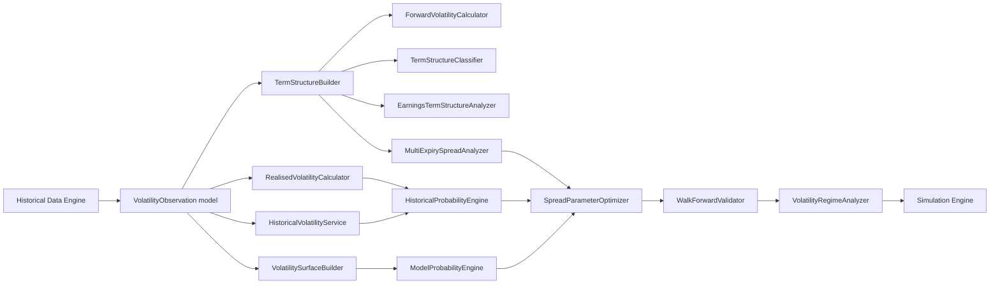
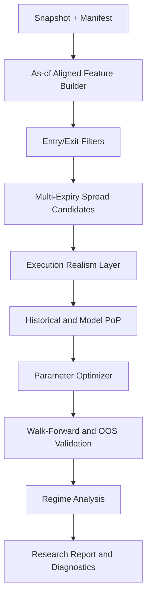

# Volatility Term Structure and Spread Optimisation Engine

## Purpose

The Volatility Term Structure and Spread Optimisation Engine is a planned research subsystem for volatility-shape analysis and multi-expiry spread research. It will support historical analysis, probability modelling, and strategy-parameter optimisation for calendar and diagonal families.

This is a documentation and architecture definition only. No production volatility or strategy logic is implemented in Sprint 3C.

Contango and backwardation are research features and entry filters, not guaranteed profit signals.

## Scope

- Historical implied volatility by strike, tenor, symbol, and timestamp.
- Realised and historical volatility over configurable windows.
- Implied-volatility term structure and forward implied-volatility estimates.
- Contango/backwardation classification, slope/curvature, and front/back ratios and differences.
- Volatility skew and surface analysis.
- Earnings-aware and event-aware term-structure analysis.
- Data-quality and stale-surface indicators.
- Multi-expiry spread analysis including calendar, diagonal, double-calendar, double-diagonal, and related structures.
- Call and put calendar comparisons.
- Strike-selection modes: ATM, OTM, and delta-selected.
- Configurable short and long DTE selection.
- Entry filters using contango/backwardation, IV rank, IV percentile, historical volatility, realised volatility, skew, and earnings timing.
- Exit rules using profit target, loss limit, DTE, delta, IV change, term-structure normalization, and event timing.
- Historical probability of profit and model-estimated probability of profit.
- Expected value and risk-adjusted performance evaluation.
- Optimisation across strike, delta, DTE, IV relationship, and management rules.
- Walk-forward testing, out-of-sample validation, and volatility regime analysis.
- Bias-safe research with no-look-ahead enforcement and realistic transaction modelling (bid/ask, slippage, commission, liquidity).

## Major Components

1. VolatilityObservation model
2. RealisedVolatilityCalculator
3. HistoricalVolatilityService
4. TermStructureBuilder
5. ForwardVolatilityCalculator
6. TermStructureClassifier
7. VolatilitySurfaceBuilder
8. EarningsTermStructureAnalyzer
9. MultiExpirySpreadAnalyzer
10. HistoricalProbabilityEngine
11. ModelProbabilityEngine
12. SpreadParameterOptimizer
13. WalkForwardValidator
14. VolatilityRegimeAnalyzer

## Required Historical Data

- Option quotes with bid/ask, timestamps, strikes, expirations, option type, and contract identifiers.
- Underlying spot and return series at matching timestamps.
- Term-specific implied volatility snapshots per strike and tenor.
- Corporate actions and symbol history for series continuity.
- Earnings and event calendars with announcement timestamps.
- Liquidity features: spread width, quoted size/depth where available, and volume/open interest.
- Transaction-cost assumptions: commissions, fees, and slippage models.
- Dataset manifests and snapshot lineage to ensure reproducibility.

## Public Interfaces

- get_volatility_observations(symbol, start_ts, end_ts, strikes, tenors)
- compute_realised_volatility(symbol, window, sampling, as_of)
- compute_historical_volatility(symbol, window, sampling, as_of)
- build_term_structure(symbol, as_of, strike_selector, tenor_set)
- compute_forward_implied_volatility(symbol, near_tenor, far_tenor, as_of)
- classify_term_structure(term_structure, thresholds)
- build_volatility_surface(symbol, as_of, interpolation_config)
- analyze_earnings_term_structure(symbol, event_id, pre_window, post_window)
- analyze_multi_expiry_spreads(symbol, config, as_of)
- estimate_historical_pop(strategy_spec, history_window, as_of)
- estimate_model_pop(strategy_spec, model_config, as_of)
- optimize_spread_parameters(search_space, objective, constraints)
- run_walk_forward_validation(strategy_spec, train_test_schedule)
- analyze_volatility_regimes(symbols, features, schedule)

## No-Look-Ahead Rules

- All calculations must use only records with timestamp <= as_of.
- Event-aware analysis must use event publication timestamps, not event effective dates alone.
- Feature engineering must align windows to decision time and exclude future bars, quotes, and outcomes.
- Walk-forward validation must train on past windows and evaluate on subsequent, non-overlapping out-of-sample segments unless explicitly configured.
- Parameter optimisation must not use out-of-sample evaluation windows during search.
- Historical probability labels must be generated from outcomes after entry time only.

## Validation Requirements

- Volatility observations must pass staleness thresholds and timestamp monotonicity checks.
- Surface construction must tag sparse, extrapolated, or stale regions.
- Term-structure classification must emit confidence/quality fields and missing-input diagnostics.
- Spread analytics must include execution realism checks for bid/ask width, liquidity floors, and slippage assumptions.
- Probability engines must report calibration diagnostics, Brier/log-loss metrics, and sample-size confidence markers.
- Optimiser outputs must include parameter-stability summaries and sensitivity diagnostics.

## Acceptance Criteria

- Term-structure builder produces deterministic outputs for identical snapshot and config inputs.
- Classifier correctly tags contango/backwardation and computes slope, curvature, and front/back metrics under documented formulas.
- Forward implied-volatility outputs include derivation metadata and quality flags.
- Multi-expiry analysis supports calendar, diagonal, double-calendar, and double-diagonal structures for calls and puts.
- Entry and exit filters are configurable and auditable from stored run configuration.
- Historical and model PoP outputs are reproducible and timestamp-safe.
- Walk-forward and out-of-sample reports include regime-split metrics and leakage checks.
- Simulation integration includes realistic bid/ask, slippage, commission, and liquidity assumptions.
- Documentation clearly states that contango/backwardation are not stand-alone profit guarantees.

## Performance Goals

- Build and classify a symbol-level term structure from a cached snapshot with low interactive latency suitable for research workflows.
- Support batch analysis across large symbol sets through vectorized/batched pipelines.
- Keep walk-forward optimisation throughput practical for multi-parameter searches with deterministic checkpointing.
- Emit quality and diagnostics metadata without materially degrading core compute throughput.

## Architecture Diagram

## Validation and Research Flow

## Roadmap Position

Planned for a future phase after:

1. Historical database foundation is complete.
2. Pricing Engine core capabilities are complete.
3. Greeks Engine core capabilities are complete.

This subsystem is a roadmap item and not part of Sprint 3C implementation scope.
