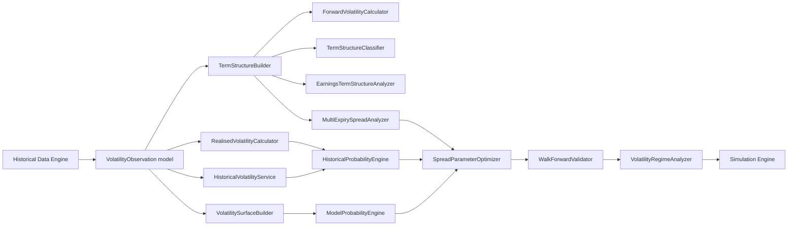
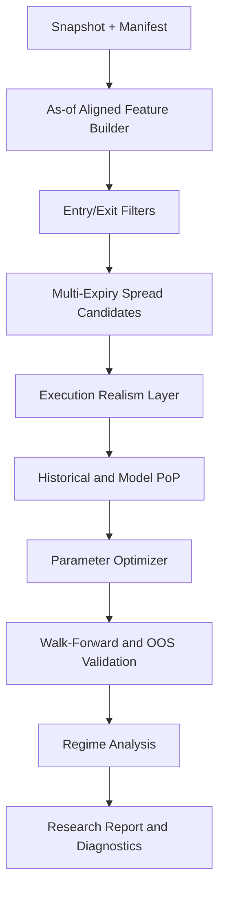
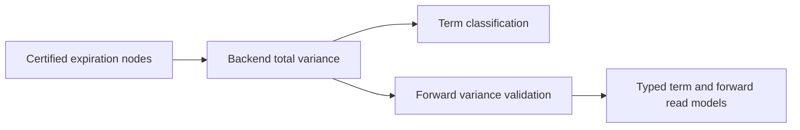

# Volatility Term Structure and Spread Optimisation Engine

## Purpose

The Volatility Term Structure and Spread Optimisation Engine is the volatility analytics subsystem for volatility-shape analysis and multi-expiry spread research. It supports historical analysis and deterministic surface-quality workflows.

Sprint 4D implements the volatility analytics foundation (historical estimators, quality scoring, smile/term/surface construction, regime labeling, and persistence primitives). Full spread optimization workflows remain future scope.

Contango and backwardation are research features and entry filters, not guaranteed profit signals.

## Scope

- Historical implied volatility by strike, tenor, symbol, and timestamp.
- Realised and historical volatility over configurable windows.
- Implied-volatility term structure and forward implied-volatility estimates.
- Contango/backwardation classification, slope/curvature, and front/back ratios and differences.
- Volatility skew and surface analysis.
- Earnings-aware and event-aware term-structure analysis.
- Data-quality and stale-surface indicators.
- Multi-expiry spread analysis including calendar, diagonal, double-calendar, double-diagonal, and related structures.
- Call and put calendar comparisons.
- Strike-selection modes: ATM, OTM, and delta-selected.
- Configurable short and long DTE selection.
- Entry filters using contango/backwardation, IV rank, IV percentile, historical volatility, realised volatility, skew, and earnings timing.
- Exit rules using profit target, loss limit, DTE, delta, IV change, term-structure normalization, and event timing.
- Historical probability of profit and model-estimated probability of profit.
- Expected value and risk-adjusted performance evaluation.
- Optimisation across strike, delta, DTE, IV relationship, and management rules.
- Walk-forward testing, out-of-sample validation, and volatility regime analysis.
- Bias-safe research with no-look-ahead enforcement and realistic transaction modelling (bid/ask, slippage, commission, liquidity).

## Major Components

1. VolatilityObservation model
2. RealisedVolatilityCalculator
3. HistoricalVolatilityService
4. TermStructureBuilder
5. ForwardVolatilityCalculator
6. TermStructureClassifier
7. VolatilitySurfaceBuilder
8. EarningsTermStructureAnalyzer
9. MultiExpirySpreadAnalyzer
10. HistoricalProbabilityEngine
11. ModelProbabilityEngine
12. SpreadParameterOptimizer
13. WalkForwardValidator
14. VolatilityRegimeAnalyzer

## Required Historical Data

- Option quotes with bid/ask, timestamps, strikes, expirations, option type, and contract identifiers.
- Underlying spot and return series at matching timestamps.
- Term-specific implied volatility snapshots per strike and tenor.
- Corporate actions and symbol history for series continuity.
- Earnings and event calendars with announcement timestamps.
- Liquidity features: spread width, quoted size/depth where available, and volume/open interest.
- Transaction-cost assumptions: commissions, fees, and slippage models.
- Dataset manifests and snapshot lineage to ensure reproducibility.

## Public Interfaces

- get_volatility_observations(symbol, start_ts, end_ts, strikes, tenors)
- compute_realised_volatility(symbol, window, sampling, as_of)
- compute_historical_volatility(symbol, window, sampling, as_of)
- build_term_structure(symbol, as_of, strike_selector, tenor_set)
- compute_forward_implied_volatility(symbol, near_tenor, far_tenor, as_of)
- classify_term_structure(term_structure, thresholds)
- build_volatility_surface(symbol, as_of, interpolation_config)
- analyze_earnings_term_structure(symbol, event_id, pre_window, post_window)
- analyze_multi_expiry_spreads(symbol, config, as_of)
- estimate_historical_pop(strategy_spec, history_window, as_of)
- estimate_model_pop(strategy_spec, model_config, as_of)
- optimize_spread_parameters(search_space, objective, constraints)
- run_walk_forward_validation(strategy_spec, train_test_schedule)
- analyze_volatility_regimes(symbols, features, schedule)

## No-Look-Ahead Rules

- All calculations must use only records with timestamp <= as_of.
- Event-aware analysis must use event publication timestamps, not event effective dates alone.
- Feature engineering must align windows to decision time and exclude future bars, quotes, and outcomes.
- Walk-forward validation must train on past windows and evaluate on subsequent, non-overlapping out-of-sample segments unless explicitly configured.
- Parameter optimisation must not use out-of-sample evaluation windows during search.
- Historical probability labels must be generated from outcomes after entry time only.

## Validation Requirements

- Volatility observations must pass staleness thresholds and timestamp monotonicity checks.
- Surface construction must tag sparse, extrapolated, or stale regions.
- Term-structure classification must emit confidence/quality fields and missing-input diagnostics.
- Spread analytics must include execution realism checks for bid/ask width, liquidity floors, and slippage assumptions.
- Probability engines must report calibration diagnostics, Brier/log-loss metrics, and sample-size confidence markers.
- Optimiser outputs must include parameter-stability summaries and sensitivity diagnostics.

## Acceptance Criteria

- Term-structure builder produces deterministic outputs for identical snapshot and config inputs.
- Classifier correctly tags contango/backwardation and computes slope, curvature, and front/back metrics under documented formulas.
- Forward implied-volatility outputs include derivation metadata and quality flags.
- Multi-expiry analysis supports calendar, diagonal, double-calendar, and double-diagonal structures for calls and puts.
- Entry and exit filters are configurable and auditable from stored run configuration.
- Historical and model PoP outputs are reproducible and timestamp-safe.
- Walk-forward and out-of-sample reports include regime-split metrics and leakage checks.
- Simulation integration includes realistic bid/ask, slippage, commission, and liquidity assumptions.
- Documentation clearly states that contango/backwardation are not stand-alone profit guarantees.

## Performance Goals

- Build and classify a symbol-level term structure from a cached snapshot with low interactive latency suitable for research workflows.
- Support batch analysis across large symbol sets through vectorized/batched pipelines.
- Keep walk-forward optimisation throughput practical for multi-parameter searches with deterministic checkpointing.
- Emit quality and diagnostics metadata without materially degrading core compute throughput.

## Architecture Diagram

## Validation and Research Flow

## Roadmap Position

Planned for a future phase after:

1. Historical database foundation is complete.
2. Pricing Engine core capabilities are complete.
3. Greeks Engine core capabilities are complete.

## Dependency Note: Sprint 4C Solver Foundation

Sprint 4C now provides a model-aware implied-volatility solver foundation in `backend/implied_volatility`.

- Solving is routed by contract metadata and compatible pricing model.
- Structured outcomes and diagnostics are suitable for downstream surface-quality workflows.
- Quote-source policy metadata is preserved for stale/crossed/wide-market diagnostics.
- Batch outputs preserve deterministic ordering across mixed contract sets and repeated timestamps.
- Result metadata now carries method-attempt diagnostics and model capabilities required for future stale-surface indicators.

Sprint 4D implements the deterministic analytics foundation; optimizer/orchestration workflows remain roadmap scope.

## Sprint 4C Integration Readiness Notes

The downstream term-structure engine can rely on current IV result contracts for:

- smile and tenor point construction keyed by selected quote source
- quality gating from structured outcomes (success, approximate, invalid market, non-convergence, unsupported)
- explicit failure reasons for data-quality dashboards
- American-model diagnostics to separate model-risk from data-quality risk

## Sprint 4D Implemented Foundation

Implemented modules in `backend/implied_volatility`:

- `realized.py`: historical volatility estimators with annualization controls and missing-session policy.
- `quality.py`: component-based quality scoring, reason codes, warnings, and exclusion recommendation.
- `construction.py`: smile builder/evaluator, term-structure builder, forward-volatility diagnostics, surface builder, and regime classifier.
- `tree_policy.py`: deterministic American tree-step escalation diagnostics.
- `persistence.py`: slice assembly and persistence adapter integration.

Implemented persistence/query support in `backend/database`:

- Volatility observation and time-slice tables with migration `0003_volatility_analytics_foundation.py`.
- Repositories and query methods for as-of smiles/term structures/surfaces.
- Nearest-prior finalized-surface retrieval with no-look-ahead behavior.

## Key Formulas

- Close-to-close realized volatility:
    $\sigma = \sqrt{\frac{A}{n-1}\sum_{t=2}^{n}(\ln(C_t/C_{t-1})-\bar r)^2}$
- Parkinson estimator:
    $\sigma = \sqrt{\frac{A}{4n\ln 2}\sum_{t=1}^{n}(\ln(H_t/L_t))^2}$
- Garman-Klass estimator:
    $\sigma^2 = A\cdot\frac{1}{n}\sum\left(0.5\ln(H/L)^2-(2\ln2-1)\ln(C/O)^2\right)$
- Forward variance between tenors $T_1<T_2$:
    $\sigma_f^2 = \frac{\sigma_2^2T_2-\sigma_1^2T_1}{T_2-T_1}$

Units:

- Implied and realized volatility values are annualized decimals.
- Tenor values are stored in calendar days.
- Timestamps are UTC and as-of constrained.

## Quality and Exclusion Policy

- Raw observations are preserved; quality scoring does not silently delete source rows.
- Exclusion recommendations trigger from low aggregate score or hard-failure reason codes.
- Explicit checks include solver status, arbitrage bounds, crossed market, missing ask, wide spread, staleness, liquidity, vega floor, pricing error, tree sensitivity, and neighborhood consistency.

## Known Limits

- Full multi-expiry spread optimizer and walk-forward optimizer remain future scope.
- Regime classification is rule-based and intentionally deterministic, not ML-based.

## Sprint 4F Research Extensions

Sprint 4F adds deterministic research engines in `backend/research` that integrate with term-structure analytics:

- `HistoricalProbabilityEngine` for as-of constrained empirical probabilities.
- `ModelProbabilityEngine` for seeded path-based probability estimates.
- `ExpectedValueEngine` for side-by-side historical expected value and model-estimated expected value reporting.
- `LifecyclePolicyEngine` for auditable policy trigger evaluation.
- `ScoreCalibrationEngine` for reliability buckets, Brier score, and calibration-error diagnostics.
- `RegimeConditionedRankingEngine` for explainable regime-aware ranking.
- `DeterministicRefinementEngine` for constrained deterministic coarse-to-fine refinement.

Probability label policy:

- Historical probability metrics and model-estimated probability metrics are always emitted with distinct names and never merged.

Model routing policy:

- Leg valuation uses metadata-driven model selection through the pricing router.
- American-style options must use configured American pricing models.
- Silent all-legs Black-Scholes fallback is prohibited.

## Deferred Optimizer Boundary

The following capabilities are explicitly deferred beyond Sprint 4F:

- Bayesian optimization
- TPE-based optimization
- Genetic/evolutionary optimizers
- ML-driven parameter search
- Distributed optimization orchestration
- Hyperparameter walk-forward optimizer tuning
# Sprint 11E presentation contract

The desktop presents backend-provided ATM term points, realised/historical references, event
premiums, classifications, and adjacent-expiration forward-volatility diagnostics. It never derives
forward variance in the browser. Negative forward variance is shown as rejected with its diagnostic,
rather than converted into a volatility value.

