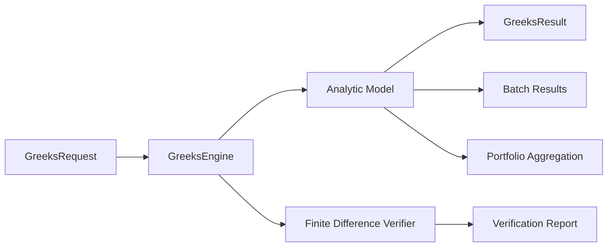

# Greeks Engine

## Purpose

The Greeks Engine provides provider-neutral sensitivity calculations for options and multi-leg positions. It extends the pricing framework with analytic Greeks and finite-difference verification workflows.

## Sprint 4B Scope

Implemented in `backend/greeks`:

- Analytic Greeks for Black-Scholes (European style)
- Finite-difference verification helpers
- Batch calculations across multiple requests
- Portfolio aggregation for multi-leg positions

No live API integrations are used.

## Supported Greeks

- Delta
- Gamma
- Theta
- Vega
- Rho
- Vanna
- Vomma
- Charm
- Color
- Speed
- Zomma
- Ultima

## Interfaces

- `calculate(request, model_name=...)`
- `calculate_batch(requests, model_name=...)`
- `calculate_portfolio(legs)`
- `finite_difference_verify(request, config=None)`

## Data Models

- `GreeksRequest`
- `GreeksResult`
- `PositionLeg`
- `PortfolioGreeksResult`
- `FiniteDifferenceConfig`
- `FiniteDifferenceVerificationResult`

## Validation Rules

Reject:

- negative volatility
- negative expiry
- invalid strike
- invalid spot
- unsupported option style
- invalid dates

## Verification Approach

- Analytic values are computed from Black-Scholes closed-form derivatives.
- Finite-difference checks compare analytic outputs against price-bump approximations.
- Verification reports include absolute and relative errors for primary and selected higher-order Greeks.

## Performance and Usage Notes

- Batch mode avoids repeated setup overhead for large request lists.
- Portfolio mode supports multi-leg spreads through signed quantity aggregation.
- Results are deterministic for identical inputs.

## Mermaid Diagram

