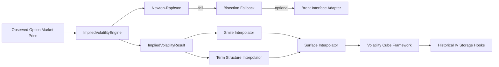

# Implied Volatility Engine

## Purpose

The Implied Volatility (IV) Engine computes implied volatility from market option prices with robust convergence controls, fallback solvers, and interpolation frameworks for smile/term-structure/surface use cases.

## Sprint 4C Scope

Implemented provider-neutral `backend/implied_volatility` components:

- IV solver engine
- Newton-Raphson primary solver
- Bisection fallback solver
- Brent solver adapter interface
- Convergence detection and residual checks
- Failure-handling modes (exception or non-converged result)
- Smile interpolation
- Term-structure interpolation
- Surface interpolation
- Volatility cube framework
- Historical IV storage hooks
- Validation layer
- Deterministic unit tests

No live API integrations are used.

## Interfaces

- `solve(request, config=None)`
- `SmileInterpolator.evaluate(strike)`
- `TermStructureInterpolator.evaluate(tenor_days)`
- `VolatilitySurfaceInterpolator.evaluate(strike=..., tenor_days=...)`
- `VolatilityCubeFramework.add_point(...)`
- `VolatilityCubeFramework.evaluate(...)`
- `HistoricalIVStorageHook.store(observation)`
- `HistoricalIVStorageHook.query(symbol=..., start_ts=..., end_ts=...)`

## Validation

The engine rejects:

- non-positive market prices
- prices below intrinsic value
- prices above simple no-arbitrage upper bounds
- invalid solver bounds (upper <= lower)

Pricing request validation is inherited from the pricing framework for spot/strike/date/style constraints.

## Convergence and Failure Handling

- Newton-Raphson is attempted first.
- Bisection is used as fallback when Newton fails or leaves bounds.
- Brent interface can be invoked as a final adapter path when configured.
- Convergence is detected using residual and interval tolerance criteria.
- Failure handling supports:
  - non-converged result object (`raise_on_failure=False`)
  - explicit exception (`raise_on_failure=True`)

## Interpolation and Cube

- Smile interpolation: linear by strike for fixed tenor.
- Term-structure interpolation: linear by tenor for fixed strike.
- Surface interpolation: strike smile interpolation per tenor with tenor blending.
- Volatility cube: symbol/date/tenor/strike storage and interpolated evaluation.

## Mermaid Diagram

