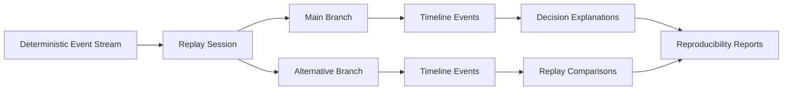

# 30 Backtesting Engine (Detailed Sprint 6A)

## Deterministic Clock Contracts

`HistoricalEventClock` consumes trading sessions and timed events and emits immutable `DeterministicEvent` rows.

Ordering key:

1. timestamp
2. configured event priority
3. event type
4. sequence hint

Duplicate handling policies:

- keep-first
- keep-last
- keep-all
- raise

## Lifecycle Boundaries

The loop is strategy-agnostic and only calls the stable lifecycle interface:

- initialize
- evaluate_entry
- create_position
- mark_position
- evaluate_management_rules
- evaluate_exit
- evaluate_roll_eligibility
- process_expiration
- finalize

## Fill and Valuation Boundaries

- Historical bid/ask remain the source of truth.
- Theoretical pricing is only a fallback for valuation and never overwrites historical prices.
- Baseline fills are deterministic placeholders, not production execution realism.

## Sprint 6B Update
- Added deterministic strategy state-machine support for multi-leg historical orchestration.
- Added explicit transition guards/actions, partial-fill reconciliation, and roll-planning scaffolding.
- Added PMCC/synthetic covered call and calendar/diagonal readiness metadata without live execution.
- Preserved no-look-ahead and nearest-prior semantics across lifecycle and query services.

## Sprint 9B Update

- Added deterministic replay workspace extension with sessions, branches, checkpoints, bookmarks, annotations, and branch comparisons.
- Added decision-intelligence payload support for explanation artifacts and branch-level diagnostics.
- Added replay reproducibility report persistence for run-to-run parity validation.

