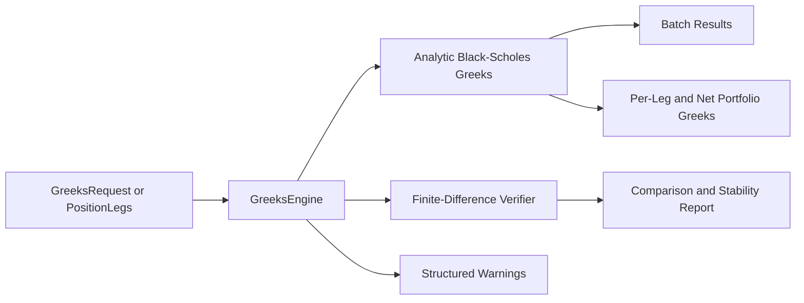

# Greeks Engine

## Purpose

The Greeks Engine provides provider-neutral option sensitivity analytics for single options and multi-leg portfolios while preserving strict model boundaries with the pricing engine.

## Sprint 4B Scope

Implemented in backend/greeks:

- First-order Greeks: delta, gamma, theta, vega, rho
- Higher-order Greeks: vanna, vomma, charm, color, speed, zomma, ultima
- Analytic Black-Scholes formulas for European options
- Finite-difference verification with configurable bump sizes and central differences
- Structured warnings for numerical instability and unsupported verification dimensions
- Batch interfaces and deterministic portfolio aggregation
- Optional benchmark hook for batch runtime

## Sprint 4B.1 - US Listed Compatibility Extension

The Greeks subsystem now routes by contract metadata through pricing-model selection rules.

- European spot contracts -> analytic Black-Scholes Greeks (first and higher order)
- European futures contracts -> analytic Black-76 first-order Greeks
- American equity/ETF contracts -> numerical first-order Greeks using selected American pricing model

For American-style contracts, values are explicitly marked as numerical finite-difference Greeks. They are not labeled analytic.

No live API integrations are used.

## Interfaces

- calculate(request, model_name=...)
- calculate_batch(requests, model_name=...)
- calculate_portfolio(legs)
- finite_difference_verify(request, config=None)
- benchmark_batch_runtime(requests, iterations=...)

## Validation and Error Handling

Rejects:

- invalid spot
- invalid strike
- negative volatility
- invalid multiplier
- expiry before valuation date
- unsupported exercise style for the selected model
- invalid finite-difference bump configuration

Warnings:

- degenerate time-to-expiry or zero volatility
- near-zero time-to-expiry numerical instability risks
- unsupported finite-difference checks for selected higher-order Greeks

## Verification Method

Finite-difference verification currently reports:

- delta
- gamma
- theta
- vega
- rho
- vanna
- vomma

Each comparison includes analytic value, finite-difference estimate, absolute error, relative error, and a stability flag.

For models without higher-order support, unsupported Greeks are returned with explicit capability metadata and warnings rather than fabricated finite values.

## Batch and Portfolio Scope

- Supports calls and puts.
- Supports long and short quantities.
- Applies contract multipliers at per-option level.
- Supports arbitrary multi-leg positions.
- Returns per-leg and net portfolio Greeks.
- Produces deterministic outputs for identical inputs.

## Mermaid Diagram

## Known Limitations

- Analytic higher-order Greeks are currently implemented for Black-Scholes and European spot style only.
- Black-76 currently provides first-order Greeks only.
- American-style Greeks currently provide first-order numerical Greeks only.
- Finite-difference verification is not yet implemented for charm, color, speed, zomma, and ultima.
- Date-based time granularity means near-expiry warnings are day-resolution, not intraday.

## Sprint 4D Volatility Analytics Note

The volatility quality engine uses solver and model diagnostics from pricing/IV paths (including American tree sensitivity) as quality inputs. Greeks remain a separate engine, but first-order stability diagnostics provide supporting context for volatility observation confidence workflows.
