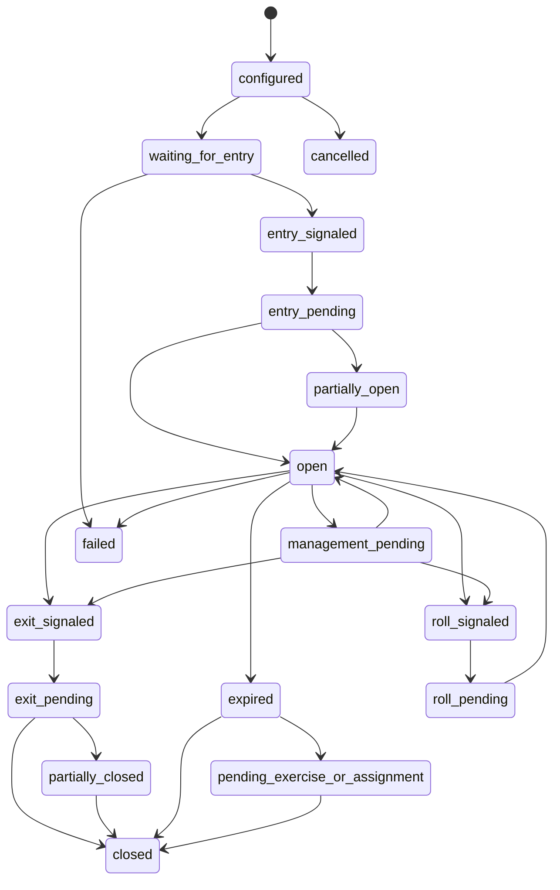

# Strategy Framework (Sprint 6B)

## Overview
Sprint 6B adds a deterministic strategy state machine and multi-leg orchestration layer on top of the historical event-loop foundation from Sprint 6A.

Scope included:
- explicit lifecycle states and validated transitions
- reusable transition guards with structured rejection reasons
- reusable transition actions and action plans
- generic multi-leg strategy definitions with template compilation
- typed leg selection policies and diagnostics
- coordinated entry planning and partial-fill reconciliation
- roll planning and roll-eligibility framework
- integrity checks and deterministic strategy histories

Out of scope (deferred):
- live broker routing
- production margin engine
- final assignment and exercise settlement

## Lifecycle States
- configured
- waiting_for_entry
- entry_signaled
- entry_pending
- partially_open
- open
- management_pending
- exit_signaled
- exit_pending
- partially_closed
- roll_signaled
- roll_pending
- expired
- pending_exercise_or_assignment
- closed
- cancelled
- failed

## Transition Model
Each transition captures:
- prior and next state
- timestamp and deterministic sequence
- trigger
- guard results
- action plan
- data snapshot reference
- strategy and position identifiers
- software commit
- warnings and failures
- checksum metadata

## Policy Conflict Resolution
Lifecycle policy signals are resolved deterministically using configurable modes:
- first_match
- priority_ordering
- all_match_diagnostics

Signals support mandatory versus advisory semantics and produce explicit conflict diagnostics.

## PMCC and Calendar Readiness
Implemented model readiness for:
- PMCC and synthetic covered call state/roll handling
- calendar and diagonal front/back leg orchestration
- residual exposure tracking after front-leg expiration
- pending exercise-or-assignment metadata markers

## Persistence and Query Semantics
Sprint 6B adds persistence for:
- strategy definitions and template usage
- strategy instances and position instances
- state transitions and transition guards
- roll plans and roll relationships
- partial fills and reconciliation events
- integrity failures and strategy histories

As-of query semantics remain nearest-prior and deterministic.

## Limitations
- Assignment/exercise settlement is represented as pending state only
- Margin compatibility remains placeholder metadata
- Roll credit/debit values are estimates from research context only
