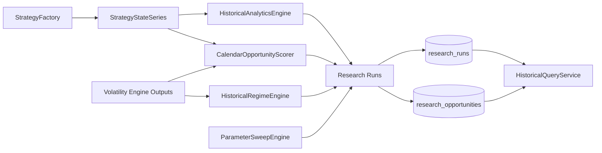

# Research Framework

## Architecture

Sprint 4E adds a reusable research framework centered on typed contracts and deterministic analytics.

## Determinism Guarantees

- exhaustive sweep case generation uses sorted keys and stable case IDs
- scoring is pure-function based for identical inputs
- analytics summary is deterministic for fixed return and state sequences
- checksums use deterministic normalized payload material
- no-look-ahead query methods enforce as-of boundaries

## Persistence Contracts

`research_runs` stores run metadata:

- configuration
- parameters
- software version
- dataset manifest linkage
- checksums
- timestamps
- quality scores
- summary metrics

`research_opportunities` stores per-date scored outcomes:

- opportunity score
- confidence
- POP and EV snapshots
- theta capture
- quality score
- term-structure regime label
- diagnostics and warnings

## Benchmarking Scope

Opt-in benchmarks currently cover:

- parameter sweep generation cost
- opportunity scoring throughput

Thread-scaling and high-volume aggregation benchmarks are staged for Sprint 4F where optimization orchestration is introduced.

## Out of Scope

- broker APIs
- order routing
- execution simulation enhancements
- optimization heuristics
- live market connectivity
