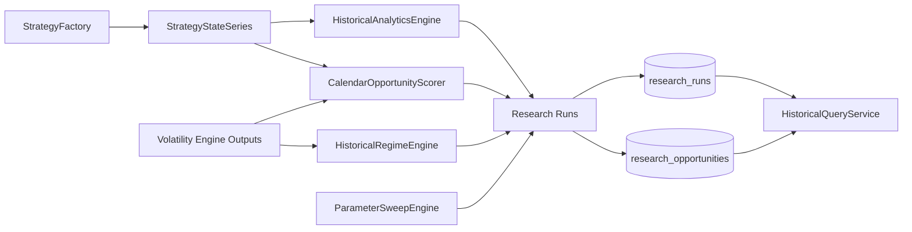
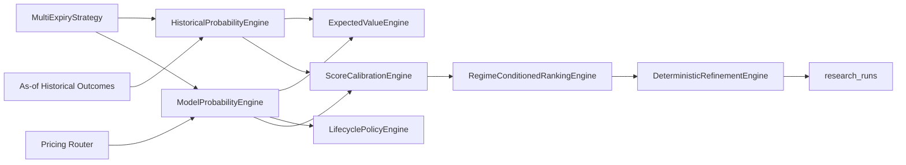
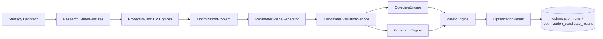

# Research Framework

## Architecture

Sprint 4E adds a reusable research framework centered on typed contracts and deterministic analytics.

## Determinism Guarantees

- exhaustive sweep case generation uses sorted keys and stable case IDs
- scoring is pure-function based for identical inputs
- analytics summary is deterministic for fixed return and state sequences
- checksums use deterministic normalized payload material
- no-look-ahead query methods enforce as-of boundaries

## Persistence Contracts

`research_runs` stores run metadata:

- configuration
- parameters
- software version
- dataset manifest linkage
- checksums
- timestamps
- quality scores
- summary metrics

`research_opportunities` stores per-date scored outcomes:

- opportunity score
- confidence
- POP and EV snapshots
- theta capture
- quality score
- term-structure regime label
- diagnostics and warnings

## Benchmarking Scope

Opt-in benchmarks currently cover:

- parameter sweep generation cost
- opportunity scoring throughput

Thread-scaling and high-volume aggregation benchmarks are staged for Sprint 4F where optimization orchestration is introduced.

## Out of Scope

- broker APIs
- order routing
- execution simulation enhancements
- optimization heuristics
- live market connectivity

## Sprint 4F Framework Extensions

Sprint 4F extends the framework with deterministic probability, expected value comparison, lifecycle policy evaluation, calibration diagnostics, and deterministic refinement.

## Reproducibility Contract for Probability Runs

Probability runs persisted through research services must carry reproducibility keys.

Required run configuration keys:

- `strategy_definition`
- `lifecycle_policies`
- `probability_method`
- `simulation_assumptions`
- `pricing_models`
- `tree_step_settings`
- `volatility_surface_snapshot`
- `regime_classification`
- `data_quality_policy`
- `dataset_manifests`
- `parameter_set`

Required metadata keys:

- `random_seed`
- `software_git_commit`
- `result_checksums`
- `calibration_metadata`

Missing keys fail persistence validation.

## Query Safety and No-Look-Ahead

Sprint 4F query helpers for probability analytics enforce as-of boundaries:

- highest model PoP runs as of timestamp
- lowest tail-loss runs as of timestamp

No query may include runs with `run_timestamp > as_of`.

## Sprint 5A Optimization Integration

The optimization subsystem is layered on top of existing research outputs and does not replace research analytics interfaces.

This boundary keeps optimization independent from GUI, brokers, live APIs, and live execution.

## Sprint 5D Extension

Portfolio allocation and strategy-selection are added as a downstream deterministic research stage.

- Inputs are validated candidate outputs and historical analytics features.
- Outputs are reproducible allocation plans, diagnostics, and persisted run artifacts.
- No live brokerage or execution system integration is introduced.

## Sprint 6A Backtesting Event Loop Foundation

- Added deterministic historical event-loop architecture with no-look-ahead controls.
- Added provider-neutral order-intent and baseline research fill-model contracts.
- Added immutable event/trade/valuation/cash ledgers with reproducibility checksums.
- Added as-of nearest-prior query semantics and historical run-comparison support.
- Added expiration and corporate-action baseline handling with settlement deferred.

## Sprint 6B Update
- Added deterministic strategy state-machine support for multi-leg historical orchestration.
- Added explicit transition guards/actions, partial-fill reconciliation, and roll-planning scaffolding.
- Added PMCC/synthetic covered call and calendar/diagonal readiness metadata without live execution.
- Preserved no-look-ahead and nearest-prior semantics across lifecycle and query services.

## Sprint 8A Research Workflow Support

Research workflows can now request canonical strategy payloads, validate leg structures, and persist reproducible strategy-definition artifacts.

Sprint 12D adds deterministic small-tier performance evidence for optimization, serialization, and
bounded workload execution while leaving large historical and endurance suites opt-in.
