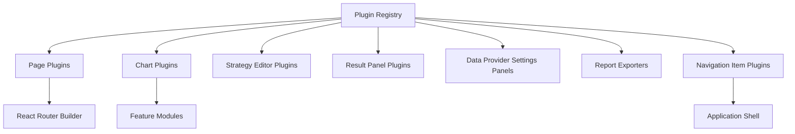

# GUI Architecture

## Purpose

Define the official frontend architecture for React and TypeScript while preserving strict separation between interface and quantitative engines.

## Stack Decisions

- React
- TypeScript
- Vite
- Material UI
- Plotly for quantitative and 3D charts
- TradingView Lightweight Charts where appropriate
- TanStack Query for API state
- Zustand for local UI state
- React Router
- Zod for runtime API validation

## Source Structure

```text
frontend/src/
  app/
  api/
  components/
  features/
  layouts/
  pages/
  routes/
  state/
  hooks/
  charts/
  theme/
  plugins/
  types/
  utils/
  tests/
```

## Boundary Rules

- Quantitative calculations stay in backend services.
- Frontend components consume typed API contracts only.
- Frontend modules do not import backend database models.
- API contracts are versioned and validated at runtime.

## Plugin-Ready Composition

Plugins are discovered through a registry, allowing pages/charts/editors/exporters/navigation entries to be added without changing core navigation logic.



## API Boundary Contracts

Typed contracts and TODO placeholders are defined for:

- health
- pricing
- Greeks
- volatility surfaces
- term structures
- strategy definitions
- backtest jobs
- optimization jobs
- research results

No unavailable backend endpoints are called in this phase.

## Deployment Targets

- Single frontend codebase deployable as local web app.
- Same codebase prepared for Tauri desktop wrapper.
- Electron is intentionally excluded.

## Acceptance Criteria

- Frontend architecture is feature-based and plugin-ready.
- Quantitative logic remains in backend services.
- Frontend components do not directly access database models.
- API contracts are typed and versionable.
- New pages and charts can be registered without changing core application logic.
- Documentation includes Mermaid diagrams.
- Existing functionality remains unchanged.


## Sprint 8A API Surface for GUI

Added V1 API contracts for strategy catalogue/detail, parameter schemas, validation results, payoff previews, risk classes, optimizer compatibility, and custom strategy creation.
