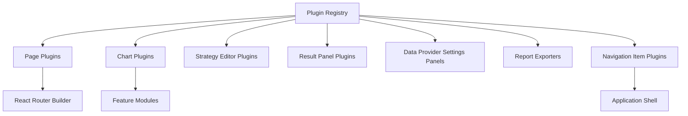
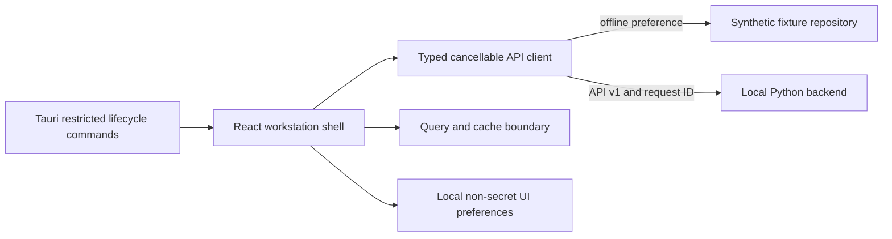

# GUI Architecture

## Purpose

Define the official frontend architecture for React and TypeScript while preserving strict separation between interface and quantitative engines.

## Stack Decisions

- React
- TypeScript
- Vite
- Material UI
- Plotly for quantitative and 3D charts
- TradingView Lightweight Charts where appropriate
- TanStack Query for API state
- Zustand for local UI state
- React Router
- Zod for runtime API validation

## Source Structure

```text
frontend/src/
  app/
  api/
  components/
  features/
  layouts/
  pages/
  routes/
  state/
  hooks/
  charts/
  theme/
  plugins/
  types/
  utils/
  tests/
```

## Boundary Rules

- Quantitative calculations stay in backend services.
- Frontend components consume typed API contracts only.
- Frontend modules do not import backend database models.
- API contracts are versioned and validated at runtime.

## Plugin-Ready Composition

Plugins are discovered through a registry, allowing pages/charts/editors/exporters/navigation entries to be added without changing core navigation logic.



## API Boundary Contracts

Sprint 11C adds a `ResearchClient` boundary for catalogue, validation, and explicit run creation.
Its offline implementation returns cloned deterministic fixtures, supports abort signals, and never
claims to execute the backend engine. Research view models mirror backend run-summary, parameter
space, walk-forward, objective, and constraint vocabulary. Quantitative scores are fixture payloads;
the browser only formats and filters them.

Draft configuration is intentionally separate from server state and stored under a dedicated local
key. Production query hooks, server persistence, terminal-state polling, and large-table
virtualization remain integration work rather than being simulated in the client.

### Sprint 11D risk boundary

`RiskClient` adds abort-aware portfolio workspace, scenario validation/launch, replay-branch, and
report-preview operations. Its fixture implementation clones deterministic payloads and rejects
invalid shocks, unconfirmed runs, incomplete branches, and unsupported report requests. Scenario
drafts remain separate from server state in a dedicated local-storage key.

`RiskWorkspace` consumes typed presentation rows for positions, exposures, matrix cells, limits,
management candidates, replay events, and report history. It never imports Python models or embeds
pricing, aggregation, limit, ranking, or narrative-generation logic.

### Sprint 11E volatility boundary

`VolatilityClient` provides abort-aware workspace, surface-validation/build, and report-preview
operations. Typed frontend records preserve backend concepts for solver convergence, smile axes,
total variance, forward-variance rejection, node kind, calibration, quality, and checksums.

No chart dependency was added. The current offline perspective renderer uses semantic HTML, SVG,
and CSS transforms over supplied nodes only, avoiding telemetry, CDN resources, and bundle-heavy
WebGL dependencies. A production WebGL renderer remains a Sprint 11F decision after profiling; the
node table and 2D views remain mandatory fallbacks regardless of renderer choice.

Typed contracts and TODO placeholders are defined for:

- health
- pricing
- Greeks
- volatility surfaces
- term structures
- strategy definitions
- backtest jobs
- optimization jobs
- research results

No unavailable backend endpoints are called in this phase.

## Deployment Targets

- Single frontend codebase deployable as local web app.
- Same codebase prepared for Tauri desktop wrapper.
- Electron is intentionally excluded.

## Acceptance Criteria

- Frontend architecture is feature-based and plugin-ready.
- Quantitative logic remains in backend services.
- Frontend components do not directly access database models.
- API contracts are typed and versionable.
- New pages and charts can be registered without changing core application logic.
- Documentation includes Mermaid diagrams.
- Existing functionality remains unchanged.

## Sprint 11A runtime architecture



Tauri owns desktop lifecycle presentation, not provider business logic. The browser layer can only
request typed backend operations and never receives provider secrets. Offline demo mode is the
default and labels every fixture view as synthetic. The Tauri capability surface intentionally
excludes unrestricted shell execution.

The shell provides primary navigation, application/backend/provider status, command-launcher and
keyboard-hook boundaries, global workspace content, and a status bar. Provider operations are the
only fully implemented Sprint 11A feature; later research routes render intentional placeholders.

Frontend commands are `make frontend-install`, `make frontend-lint`, `make frontend-typecheck`,
`make frontend-test`, and `make frontend-build`.


## Sprint 8A API Surface for GUI

Added V1 API contracts for strategy catalogue/detail, parameter schemas, validation results, payoff previews, risk classes, optimizer compatibility, and custom strategy creation.
# Sprint 11F production integration

Runtime configuration, shared HTTP transport, compatibility, workspaces, polling, logging, and
diagnostics are provider-neutral modules. The shell displays its explicit mode; failed health checks
fall back only when fixture mode was configured. Route splitting, broad virtualization, and a
production WebGL library remain blockers pending production endpoints and desktop profiling.
