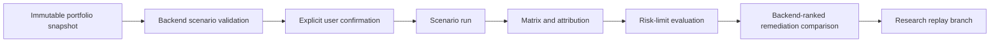

# 41 Risk Engine (Portfolio Extension, Sprint 5D)

## Sprint 5D Additions

The risk layer now includes deterministic marginal risk contribution analysis for portfolio allocation candidates.

Inputs:

- Candidate risk/exposure snapshots.
- Proposed allocation weights.

Outputs per candidate:

- Before/after variance proxy.
- Before/after expected shortfall and drawdown.
- Greeks deltas (delta, gamma, vega, theta).
- Capital, liquidity-risk, and model-risk movement.
- Regime concentration movement.

## Design Constraints

- Research-only risk assessment; not a live risk monitor.
- Deterministic ordering by candidate ID.
- No live market or broker dependencies.

## Sprint 6A Backtesting Event Loop Foundation

- Added deterministic historical event-loop architecture with no-look-ahead controls.
- Added provider-neutral order-intent and baseline research fill-model contracts.
- Added immutable event/trade/valuation/cash ledgers with reproducibility checksums.
- Added as-of nearest-prior query semantics and historical run-comparison support.
- Added expiration and corporate-action baseline handling with settlement deferred.

## Sprint 6B Update
- Added deterministic strategy state-machine support for multi-leg historical orchestration.
- Added explicit transition guards/actions, partial-fill reconciliation, and roll-planning scaffolding.
- Added PMCC/synthetic covered call and calendar/diagonal readiness metadata without live execution.
- Preserved no-look-ahead and nearest-prior semantics across lifecycle and query services.

## Sprint 8A Risk Classification Inputs

Risk engine interfaces now include strategy-library risk classification metadata and payoff-derived risk characteristics.

## Sprint 9B Typed Risk Query Read Models

- Added typed read-model query paths for scenario catalogue, versions, runs, matrix points, attribution, limit breaches, management comparisons, metadata, and reproducibility checksums.
- Existing dict-style query methods remain available for backward compatibility.

## Sprint 11D risk-lab presentation

The desktop risk lab consumes the existing scenario catalogue, run, matrix, attribution, breach,
management-comparison, and checksum read models. It does not reprice instruments, evaluate limits,
rank remediation, or choose actions in the browser. Offline values are deterministic synthetic
payloads and are labelled as calculated, model-derived, observed fixture state, or fixture metadata.

Remediation selection records a research preference only. There is no broker, order staging,
routing, or execution capability in this workspace, and scenario results are never forecasts.

Sprint 12D adds grid-size guards and performance-readiness reporting so very large scenario matrices
can be bounded or rejected cleanly instead of growing without limit.
