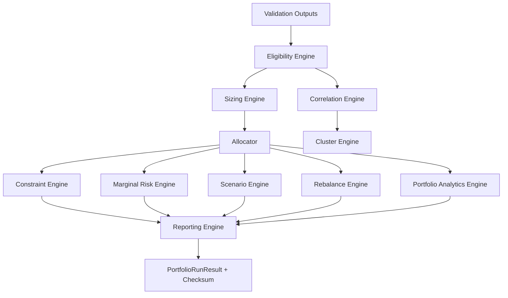

# 42 Portfolio Engine (Sprint 5D)

## Scope

Sprint 5D adds a deterministic, research-only portfolio allocation and strategy-selection engine.

Primary responsibilities:

- Candidate eligibility filtering from Sprint 5C validation outputs.
- Correlation estimation and sparse-sample uncertainty tagging.
- Risk-factor clustering for diversification-aware explainability.
- Position sizing and constrained allocation construction.
- Marginal risk contribution, scenario aggregation, and rebalance planning.
- Structured reporting with explicit limitations and warning surfaces.

Non-goals and boundaries:

- No live API connectivity.
- No broker connectivity.
- No live order routing or execution.
- No replacement of stable public interfaces in existing modules.

## Engine Topology

## Persistence Model

Sprint 5D introduces normalized tables for reproducible portfolio runs:

- portfolio_runs
- portfolio_eligible_candidates
- portfolio_rejected_candidates
- portfolio_allocations
- portfolio_constraint_outcomes
- portfolio_correlations
- portfolio_clusters
- portfolio_risk_contributions
- portfolio_scenarios
- portfolio_rebalance_plans

Design rules:

- Deterministic upsert keys for each table.
- Explicit run-level reproducibility metadata is mandatory before write.
- Deterministic run checksum helper is order-stable for allocation rows.

## No-Look-Ahead Controls

Construction path enforces a strict guard using optional as_of_timestamp metadata:

- Candidate timestamps newer than the allocation as-of timestamp are rejected.
- Violations raise a hard error and prevent run materialization.

## Validation and Quality Gates

Added tests:

- backend/tests/test_portfolio_engine_foundation.py
- backend/tests/test_portfolio_persistence.py
- backend/tests/test_portfolio_benchmarks_opt_in.py

Benchmark execution remains opt-in via RUN_OPT_IN_BENCHMARKS=1.

## Sprint 6A Backtesting Event Loop Foundation

- Added deterministic historical event-loop architecture with no-look-ahead controls.
- Added provider-neutral order-intent and baseline research fill-model contracts.
- Added immutable event/trade/valuation/cash ledgers with reproducibility checksums.
- Added as-of nearest-prior query semantics and historical run-comparison support.
- Added expiration and corporate-action baseline handling with settlement deferred.
