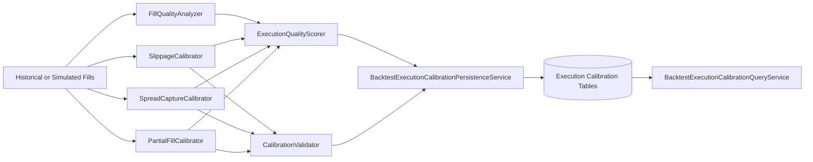

# Execution Calibration and Broker Policy (Sprint 7C)

## Scope

Sprint 7C adds deterministic, offline execution calibration and broker-policy research adapters.
The implementation is designed for reproducible historical research and does not integrate live broker APIs.

## Architecture Summary

- Execution calibration domain logic: backend/backtesting/execution_calibration.py
- Opt-in execution benchmarks: backend/backtesting/execution_benchmarks.py
- Persistence service and query service: backend/database/execution_calibration.py
- Persistence repositories: backend/database/repositories/execution_calibration.py
- Database entities: backend/database/models/entities.py
- Schema migration: backend/database/migrations/versions/0013_execution_calibration_policy_validation.py

## Persistence Model

Sprint 7C introduces normalized tables for:

- Calibration datasets and fill-quality observations
- Slippage, spread-capture, and partial-fill model snapshots
- Transaction-cost policies and broker policy versions
- Policy comparisons and execution quality scores
- Real-vs-simulated comparisons
- Validation runs and calibration drift events
- Stress-test results and execution-calibration checksums

```mermaid
flowchart TD
    R[backtest_runs] --> D1[execution_calibration_datasets]
    R --> D2[execution_fill_quality_observations]
    R --> D3[execution_slippage_models]
    R --> D4[execution_spread_capture_models]
    R --> D5[execution_partial_fill_models]
    R --> D6[execution_transaction_cost_policies]
    R --> D7[execution_broker_policy_versions]
    R --> D8[execution_policy_comparisons]
    R --> D9[execution_quality_scores]
    R --> D10[execution_real_vs_simulated]
    R --> D11[execution_validation_runs]
    R --> D12[execution_calibration_drift]
    R --> D13[execution_stress_test_results]
    R --> D14[execution_calibration_checksums]
```

## Broker Policy Adapter Notes

Implemented adapters are research-policy approximations:

- Generic baseline
- Interactive Brokers style (research)
- tastytrade style (research)
- Schwab/thinkorswim style (research)
- User-defined policy

All adapters expose version metadata, fee schedule, capability assumptions, and ambiguity warnings.
Warnings are surfaced in comparison results for transparency.

## Validation and Quality Gates

- Deterministic tests cover calibrators, scoring, stress scenarios, persistence, and migration upgrade/downgrade.
- Opt-in benchmark execution is gated by RUN_EXECUTION_BENCHMARKS=1.
- Sprint 7C changes passed make lint and make test quality gates.

## Limitations

- Offline only; no live broker integration.
- No official broker-fee/margin parity guarantee.
- Market impact remains a placeholder estimator.
- No venue-level queue-position simulation.
- Real-vs-simulated comparison requires imported fills from external workflows.

## Sprint 8 Boundary

Planned next-step targets:

1. Broker statement reconciliation workflows.
2. Policy-version governance and richer change audits.
3. Drift monitoring and recalibration orchestration.
4. More realistic market-impact and queue-position modeling.
5. Optional venue-aware execution simulation under deterministic controls.
