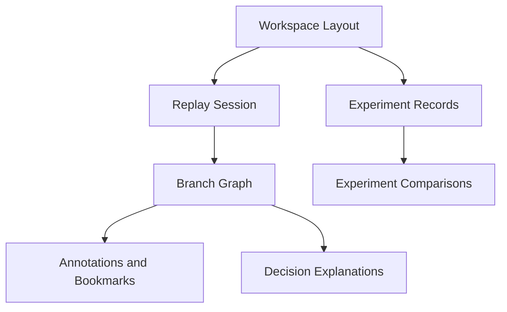

# Workspace Architecture

## Purpose

Specify the frontend workspace model for panel composition, layout persistence, presets, and configuration portability.

## Workspace Capabilities

- Resizable panels.
- Named saved layouts.
- Feature-aware panel visibility.
- Workspace import/export with versioned schema.
- Quick reset to default layout.

## Strategy Configuration UX

- Undo and reset controls.
- Saved presets.
- Progressive advanced settings panels.
- Inline explanations and warning hints.

## Layout Model

- Layout metadata: id, name, timestamps.
- Panel placements: width, height, position, visibility.
- Responsive breakpoint variants.

## Workspace Lifecycle

## Accessibility and Usability

- Keyboard-only navigation for panel focus and movement.
- Minimum touch targets for mobile-friendly controls.
- High-contrast compatibility for both theme modes.
- Screen-reader labels for interactive workspace controls.

## Sprint 9B Replay Workspace Extension

- Replay session workspace artifacts now persist as deterministic offline records.
- Workspace state includes sessions, branches, bookmarks, checkpoints, filters, annotations, comparisons, and decision explanations.
- Experiment workspace tracks hypothesis metadata, scenario/replay sets, and comparison artifacts for reproducible research review.

# Sprint 11F durable workspace boundary

Versioned documents include workspace type, schema and resource versions, checksum, timestamp, and
presentation payload. Import validation rejects incomplete or unsupported schemas. Conflict
detection distinguishes local-newer, server-newer, checksum mismatch, deletion, and incompatible
schemas; newer state is never silently overwritten. Autosave runs only for valid documents when
compatibility permits mutations. Actual durable saves await mounted workspace HTTP handlers.

## Sprint 12A compatibility

Version 1 RC metadata declares workspace schema `1` as both the minimum and current compatible
document schema. Diagnostic bundles include the workspace schema version, but no workspace payloads,
credentials, full private paths, or licensed data. Workspace import/export behavior remains governed
by the existing schema validator and desktop file-safety checks.
