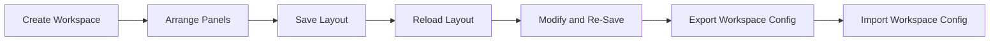

# Workspace Architecture

## Purpose

Specify the frontend workspace model for panel composition, layout persistence, presets, and configuration portability.

## Workspace Capabilities

- Resizable panels.
- Named saved layouts.
- Feature-aware panel visibility.
- Workspace import/export with versioned schema.
- Quick reset to default layout.

## Strategy Configuration UX

- Undo and reset controls.
- Saved presets.
- Progressive advanced settings panels.
- Inline explanations and warning hints.

## Layout Model

- Layout metadata: id, name, timestamps.
- Panel placements: width, height, position, visibility.
- Responsive breakpoint variants.

## Workspace Lifecycle

## Accessibility and Usability

- Keyboard-only navigation for panel focus and movement.
- Minimum touch targets for mobile-friendly controls.
- High-contrast compatibility for both theme modes.
- Screen-reader labels for interactive workspace controls.
