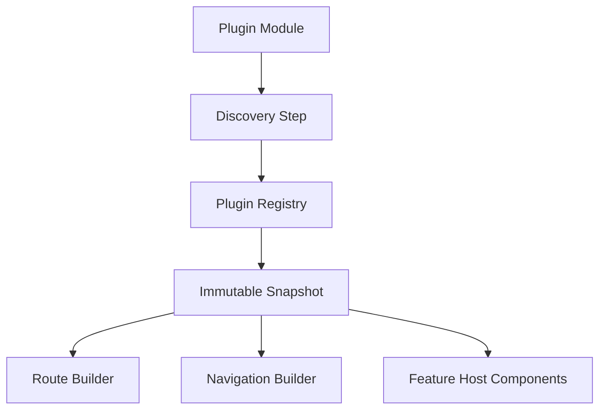

# Frontend Plugin Architecture

## Purpose

Define plugin contracts and registration flow for extending the frontend without core navigation rewrites.

## Plugin Types

- Page plugins
- Chart plugins
- Strategy editor plugins
- Result panel plugins
- Data-provider settings panel plugins
- Report exporter plugins
- Navigation item plugins

## Registry Rules

- Plugins are discovered and registered through a central registry.
- Router and navigation are built from registry snapshots.
- Core navigation files remain unchanged when adding plugins.
- Plugin metadata includes stable identifiers and optional feature flags.

## Registration Flow

## Safety and Compatibility

- Plugins must depend only on public frontend contracts.
- Plugins must not access backend database types directly.
- Plugin failures should be isolated with fallback UI.
- Plugin contracts should be versioned for compatibility checks.
