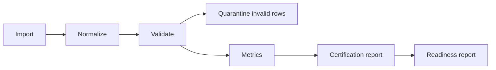

# Data Certification

Sprint 12C certification is deterministic and fixture-backed. Certification
reports include contract completeness, quote completeness, quarantine rate,
crossed-market rate, multiplier coverage, exclusions, warnings, and a
reproducibility checksum.

Certification levels are `rejected`, `fixture_only`, `import_certified`, and
`live_validated`. Fixture-only and import-certified results are not public
live-provider readiness claims.

