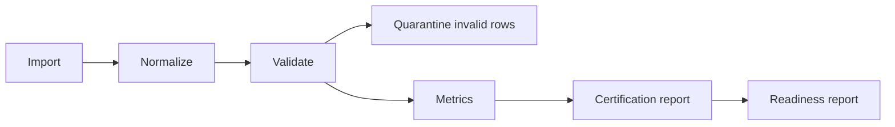

# Data Certification

Certification is deterministic and fixture-backed.

## Certification levels

- `uncertified`
- `imported`
- `structurally_valid`
- `quality_checked`
- `research_ready`
- `research_ready_with_warnings`
- `restricted`
- `rejected`

Lower-level system states such as `fixture_only`, `import_certified`, and
`live_validated` remain implementation-specific evidence, but user-facing
decisions should treat uncertified datasets conservatively.

## What a report includes

- contract completeness;
- quote completeness;
- quarantine rate;
- crossed-market rate;
- multiplier coverage;
- exclusions;
- warnings;
- reproducibility checksum.

Uncertified or warning-heavy datasets should not be treated as serious research
inputs without additional review.

