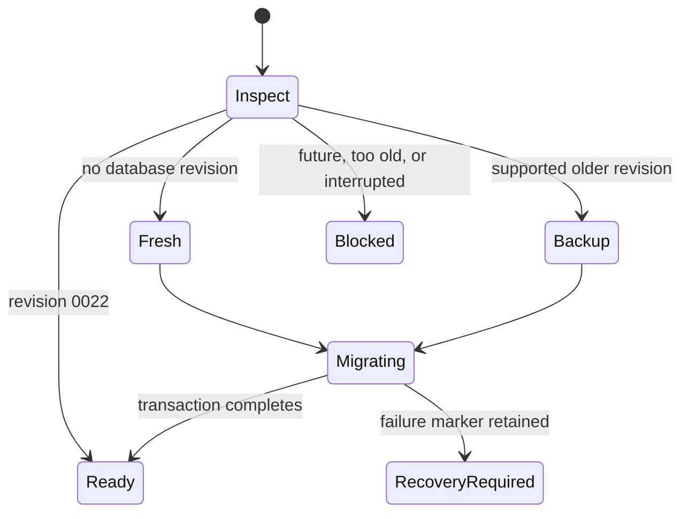

# Packaged Database Migrations

The packaged sidecar initializes a user-owned application-data directory, then checks the database
before opening the health endpoint. Current schema is Alembic `0022`; the supported automatic upgrade
range begins at `0018`. Future schemas, older schemas, corrupt metadata, and interrupted migrations
block readiness instead of continuing silently.

Supported upgrades create a deterministic pre-migration backup and SHA-256 sidecar metadata after
checking available disk space. The original backup is never deleted automatically. Fresh databases
are migrated without fabricated market-data seeds. Restore by closing the application, preserving
the failed database for diagnostics, verifying the backup checksum, and copying the backup to the
configured database filename.

Migration policies are automatic for the packaged RC and validate-only when explicitly selected for
diagnostics. Downgrades are unsupported; committed migrations are immutable.
