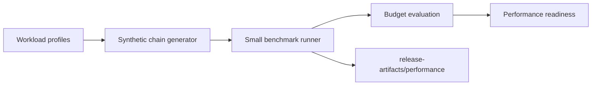

# Performance

Sprint 12D adds a deterministic performance-validation layer built around
synthetic workload profiles, small benchmark artifacts, budget evaluation, and
readiness reporting. The measured default tier remains credential-free and fast
enough for local and CI quality gates.

Workload profiles:

- `tiny`
- `small`
- `medium`
- `large`
- `very_large`
- `endurance`

Measured default commands:

- `make benchmark-small`
- `make performance-check`

Opt-in commands:

- `make benchmark-large`
- `make stress-test`
- `make endurance-test`

Evidence is written to `release-artifacts/performance/` and includes benchmark
summary, workload manifest, database and optimizer benchmark slices, resource
usage, and performance readiness.

