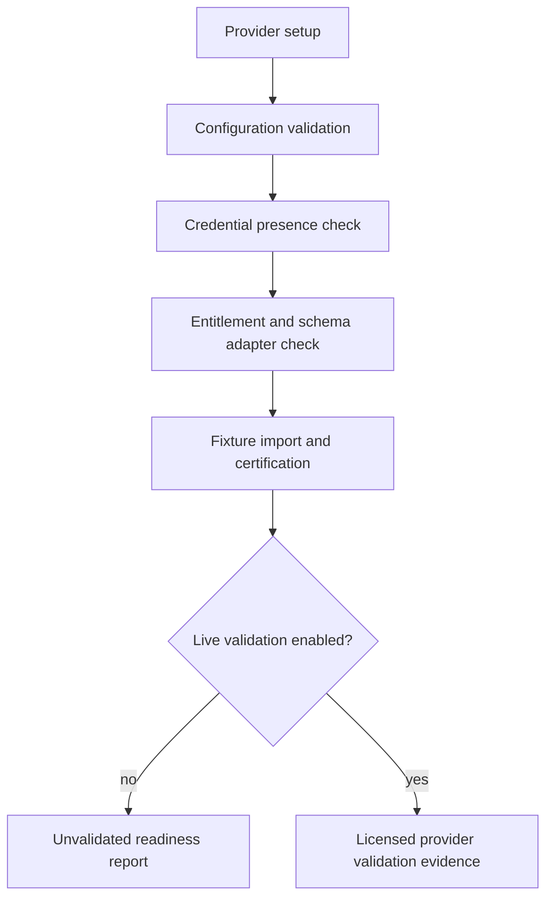

# Provider Setup

Provider setup is optional for offline demo mode.

Sprint 12C adds a credential-safe boundary for ORATS, Databento, Cboe, and
Polygon. Standard development, release, and CI checks remain offline and do not
require provider credentials.

## Capability matrix summary

- Validated offline path: fixture mode for all documented workflows.
- Live validation status: conservative and evidence-based.
- Licensed-data handling: restricted by export and diagnostics policy.

## Configuration model

Provider configuration records include:

- provider id;
- environment;
- dataset and schema;
- symbol/date scope;
- retry and timeout settings;
- cache policy;
- licensing classification;
- export policy.

Credential fields must be references, not secret values.

## Credential rules

- Do not store secrets in frontend storage, workspace files, logs, diagnostics,
  manifests, exports, or release artifacts.
- Report credential presence and validation status only.
- Prefer macOS Keychain for installed desktop builds when wired by the runtime.
- Use environment references for development validation.
- Delete, revoke, rotate, and retest credentials through provider-specific
  flows before any live-provider claim.

## Troubleshooting focus

- Missing credentials should resolve to `not_configured` or equivalent status.
- Failed authentication and entitlement errors should remain explicit.
- Export restrictions should remain visible for licensed or restricted data.

Known boundary: Sprint 12C does not ship committed credentials, licensed sample
payloads, broker connectivity, or public-release provider readiness claims.
