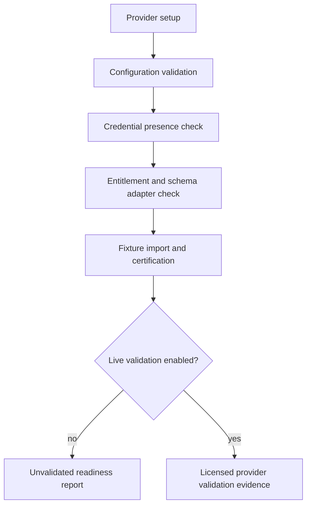

# Provider Setup

Sprint 12C adds a credential-safe setup boundary for ORATS, Databento, Cboe,
and Polygon. Standard development, release, and CI checks remain offline and do
not require provider credentials.

Provider configuration records include provider id, environment, dataset, schema,
symbol/date scope, retry and timeout settings, cache policy, licensing
classification, and export policy. Credential fields must be references, not
secret values.

Credential rules:

- do not store secrets in frontend storage, workspace files, logs, diagnostics,
  manifests, exports, or release artifacts;
- report credential presence and validation status only;
- prefer macOS Keychain for installed desktop builds when wired by the runtime;
- use environment references for development validation;
- delete, revoke, rotate, and test credentials through provider-specific setup
  flows before any live-provider claim.

Known boundary: Sprint 12C does not ship committed credentials, licensed sample
payloads, broker connectivity, or public-release provider readiness claims.
