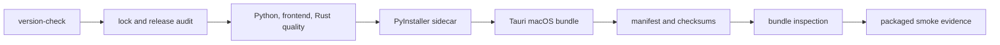

# Version 1 Release Process

The canonical application version is `release/version.json`. `make version-check` fails if Python,
Poetry, npm, Cargo, Tauri, or generated frontend metadata differs. Application, API, database,
workspace, report, export, fixture, and sidecar protocol versions are deliberately independent.

## Profiles and policy

`release/profiles.json` defines development, test, offline demo, release candidate, and production
release behavior. Telemetry is disabled in every profile. Release-candidate builds require a clean
Git tree. Public builds additionally require an exact `1.0.0-rc.1` or `v1.0.0-rc.1` tag. Commands
never create or push tags.

Use `make release-check` for a dirty development audit, `make release-build` for a local unsigned
development bundle, and `make rc-build` only from a clean tree. Artifacts are written under the
Git-ignored `release-artifacts/` directory. Signing and notarization are not Sprint 12A claims.

## Semantic version boundaries

- Application: SemVer, including `-rc.N` prereleases.
- API: major route namespace such as `v1`.
- Database: immutable Alembic revision identifiers and a supported range.
- Workspace: integer document schema with validate-before-import behavior.
- Reports and exports: independent deterministic format versions.
- Fixtures: synthetic dataset/content version.
- Sidecar protocol: desktop-to-backend startup and readiness contract version.

Dependency inputs are locked by Python, npm, and Cargo lock files. A public release remains blocked
until clean-machine testing, licence review, signing, and notarization complete.
