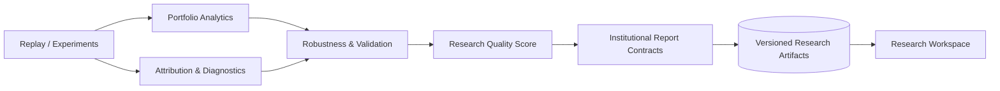

# Sprint 9 Checklist

## Sprint 9A - Risk Lab Persistence and Query Foundation

- [x] Added risk lab DTOs, ORM entities, repositories, and persistence/query services.
- [x] Added migration `0017_risk_lab_foundation.py` with upgrade/downgrade coverage.
- [x] Added deterministic checksum support for risk lab state.
- [x] Added deterministic tests for persistence and migration compatibility.
- [x] Quality gate complete: `make lint` and `make test` passing.

## Sprint 9B - Research Replay, Experiment Workspace, and Decision Intelligence

- [x] Added replay workspace DTOs for sessions, branches, checkpoints, bookmarks, events, annotations, filters, comparisons, diagnostics, reproducibility reports, decision explanations, experiments, and workspace metadata.
- [x] Added replay workspace ORM entities and migration `0018_replay_workspace_foundation.py`.
- [x] Added replay workspace repositories and query repositories.
- [x] Added replay workspace persistence/query services with deterministic checksum utility.
- [x] Extended replay engine with additive session/branch/timeline capabilities and deterministic branch checksums.
- [x] Added typed risk query read models in `RiskLabQueryService` while preserving existing dict query methods.
- [x] Added Sprint 9B API contracts for scenario catalogue/detail/run/matrix/attribution and replay session/branch/timeline/comparison/explanation payloads.
- [x] Added deterministic tests for replay workspace persistence, migration, replay engine workspace behavior, and opt-in replay workspace benchmark checksum path.

## Known Limitations

- Replay workspace persistence is deterministic and offline only; no live API or broker dependencies are introduced.
- New typed read-model methods in risk queries are additive and do not remove existing dict-style methods.
- Replay decision explanations currently store structured JSON payloads and rely on upstream policy/explainer producers for semantic detail.

## Sprint 9C - Institutional Research Layer

- [x] Added offline portfolio analytics for returns, rolling risk metrics, capture ratios, trade outcomes, capital/margin efficiency, and lifecycle frequencies.
- [x] Added dimension-preserving attribution, portfolio diagnostics, strategy comparison, robustness evidence, and an explainable research score that remains unavailable when required evidence is missing.
- [x] Added versioned backend contracts for analytics, attribution, diagnostics, research score, validation dashboard, reports, and completed workspace views.
- [x] Added versioned institutional research artifact persistence and migration `0019_institutional_research_layer.py`; artifact kinds cover analytics snapshots, attribution summaries, research scores, robustness reports, diagnostics, reports, layouts, validation summaries, and workspace history.
- [x] Report artifacts retain typed links to replay decisions, scenarios, rolls, assignments, optimization, and validation events.
- [x] Added deterministic analytics and artifact round-trip tests. All outputs remain offline and research-only.

