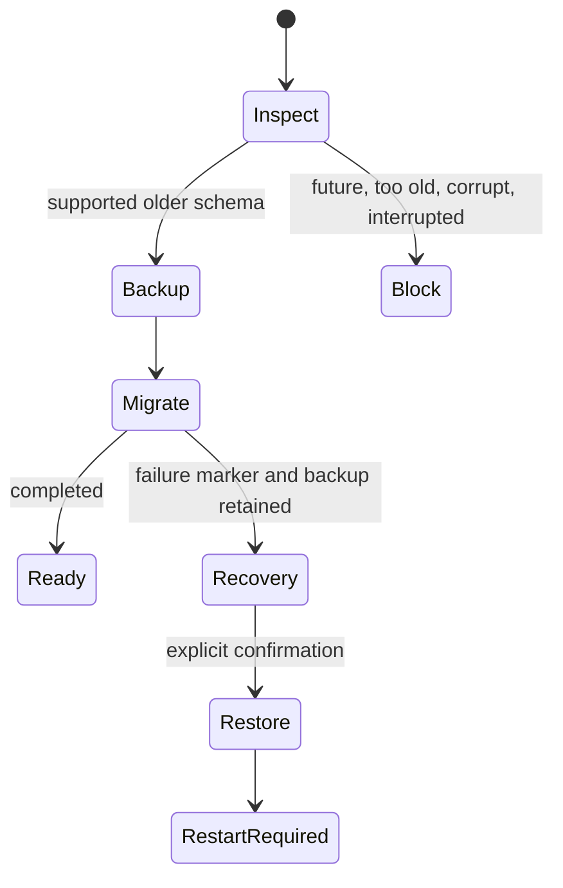

# Upgrade and Recovery

Sprint 12B validates upgrade and recovery behavior with synthetic, non-licensed fixtures.

Supported automatic database upgrades begin at Alembic `0018_replay_workspace_foundation` and target
`0022_provider_runtime_operations`. A supported older database receives a deterministic pre-migration
backup before Alembic runs. Backup metadata records source schema, target schema, checksum, size,
creation time, and release version.

Recovery rules:

- Future schemas, unsupported old schemas, corrupt databases, missing migration revision metadata,
  and stale migration markers block startup.
- Corrupt databases are never overwritten automatically.
- Restore requires explicit confirmation, checksum validation, and an immutable recovery event.
- A current database backup is created before restore when practical.

Commands:

- `make upgrade-test` creates a previous-version app-data fixture, migrates it with the packaged
  sidecar, verifies backup metadata, and writes `release-artifacts/upgrade/upgrade-evidence.json`.
- `make recovery-test` validates corrupt/future/old/interrupted states, backup restore, log
  rotation, and cache cleanup in disposable directories.

## Recovery ladder

1. Restart the app.
2. Retry in offline fixture mode.
3. Clear cache or reset UI settings if the failure is non-destructive.
4. Export workspaces and reports if the app is still reachable.
5. Use a verified backup for database restore.
6. Perform a full reset only after preserving evidence and understanding that it
   is destructive.
